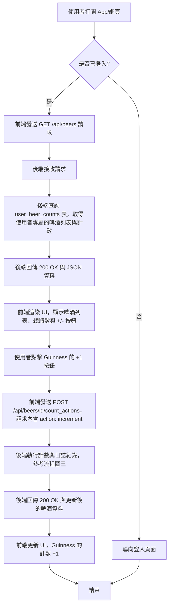

### 流程圖一：使用者查看列表與增加計數 (主要使用路徑)

這張圖描繪了使用者登入後，看到自己的啤酒列表，並為其中一瓶酒按下「+1」按鈕的完整流程。

```mermaid
graph TD
    A[使用者打開 App/網頁] --> B{是否已登入?}
    B -- 否 --> C[導向登入頁面]
    B -- 是 --> D[前端發送 GET /api/beers 請求]
    D --> E[後端接收請求]
    E --> F[後端查詢 user_beer_counts 表，取得使用者專屬的啤酒列表與計數]
    F --> G[後端回傳 200 OK 與 JSON 資料]
    G --> H[前端渲染 UI，顯示啤酒列表、總瓶數與 +/- 按鈕]
    H --> I[使用者點擊 Guinness 的 +1 按鈕]
    I --> J[前端發送 POST /api/beers/id/count_actions，請求內含 action: increment]
    J --> K[後端執行計數與日誌紀錄，參考流程圖三]
    K --> L[後端回傳 200 OK 與更新後的啤酒資料]
    L --> M[前端更新 UI，Guinness 的計數 +1]
    M --> N[結束]
    C --> N
```