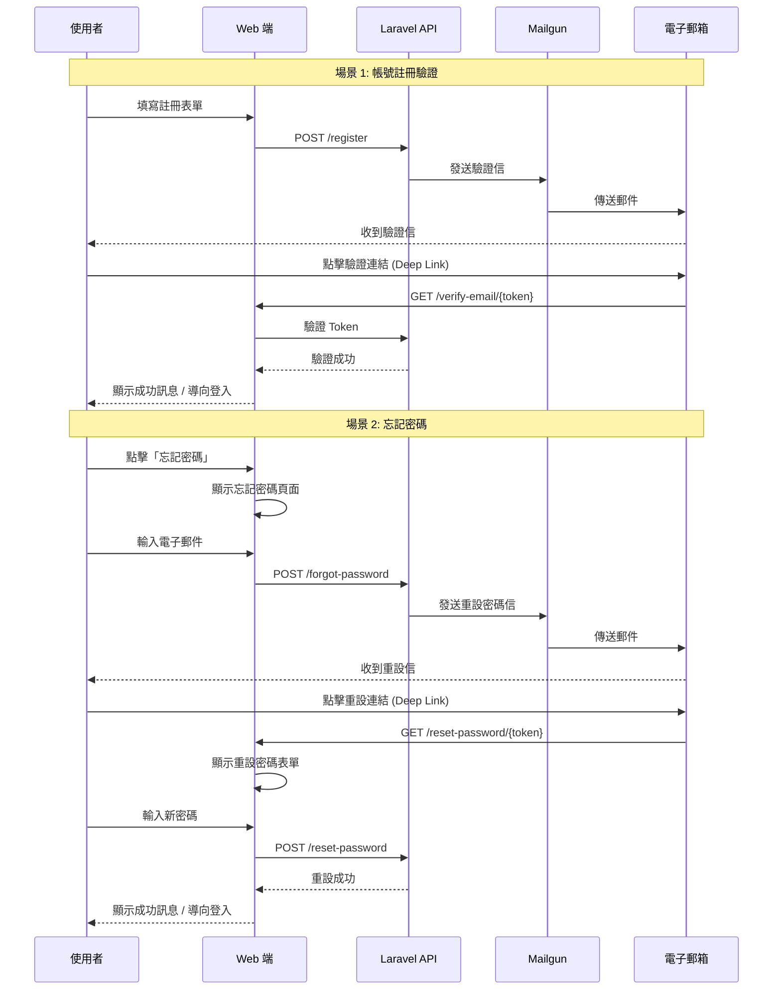

# Session: Mailgun 郵件服務整合 - 帳號驗證與密碼重設

**Date**: 2025-12-05
**Status**: ✅ Completed (Core Features) / 🟡 Partial (Testing)
**Duration**: ~3.5 hours (實際)
**Issue**: N/A
**Contributors**: @kiddchan, Claude AI
**Branch**: feature/mailgun-integration
**Tags**: #infrastructure #api #authentication

**Categories**: Email Service, API Integration, Authentication, Backend

---

## 📋 Overview

### Goal
- 使用 mailgun 作為目前寄送帳號驗證工具，我已經有API KEY了。
- 也同時建立API提供deeplink

場景：
1.註冊後發送驗證信
2.網際密碼也提供驗信，確認目前有沒有忘記密碼的畫面(web端)


### Related Documents
- **Laravel Mail Documentation**: https://laravel.com/docs/11.x/mail
- **Laravel Auth**: https://laravel.com/docs/11.x/authentication
- **Mailgun API**: https://documentation.mailgun.com/
- **Project CLAUDE.md**: `/HoldYourBeer/CLAUDE.md`

### Commits
- 待開發完成後填寫

---

## 🎯 Context

### Problem
目前 HoldYourBeer 系統缺乏郵件發送功能，導致無法進行：
- 使用者註冊後的帳號驗證
- 密碼重設功能（忘記密碼）
- 透過 Deep Link 引導使用者回到應用程式

### User Story
> 身為新註冊的使用者，我希望在註冊後收到驗證信，以便確認我的電子郵件地址並啟用帳號。
>
> 身為忘記密碼的使用者，我希望能透過電子郵件重設密碼，以便重新登入系統。

### User Flow


### Current State (專案開始前)
- **已存在**:
  - Laravel 11.x 基礎架構
  - 使用者認證系統基礎 (Laravel Breeze)
  - 忘記密碼頁面 (Web 端) - `forgot-password.blade.php`, `reset-password.blade.php`
  - 密碼重設控制器 - `PasswordResetLinkController`, `NewPasswordController`
  - Email 驗證頁面 - `verify-email.blade.php`

- **不存在**:
  - Mailgun 郵件服務設定
  - 自訂多語系郵件 Notification
  - API 端點 (Email Verification, Password Reset)
  - Deep Link 支援與文件
  - 完整的自動化測試

**Gap**: 需要整合 Mailgun 郵件服務、建立自訂多語系通知、實作 API 端點、設計 Deep Link 支援

---

## 💡 Planning

### Approach Analysis

#### Option A: 使用 Mailgun + Laravel 內建驗證系統 [✅ CHOSEN]
使用 Mailgun 作為郵件服務，整合 Laravel 內建的 Email Verification 和 Password Reset 功能

**Pros**:
- Laravel 內建支援，實作快速
- Mailgun 整合簡單，用戶已有 API Key
- 利用 Laravel 現有的 `MustVerifyEmail` interface
- 安全性佳（使用 signed URLs 和 token）
- 易於維護和測試

**Cons**:
- 需要自訂 Notification 以支援多語系
- 需要設計 Deep Link URL 格式以支援 Flutter App

#### Option B: 自建驗證系統 + 第三方郵件服務 [❌ REJECTED]
完全客製化驗證系統，不使用 Laravel 內建功能

**Pros**:
- 完全客製化控制
- 彈性高

**Cons**:
- 開發時間長
- 需要自行處理安全性問題（token 生成、過期、驗證）
- 容易出現安全漏洞
- 重複造輪子，違反專案開發哲學

#### Option C: 使用 SMTP (Gmail) [❌ REJECTED]
使用一般 SMTP 服務取代 Mailgun

**Pros**:
- 設定簡單

**Cons**:
- 發送限制嚴格（每天 500 封）
- 容易被標記為垃圾郵件
- 用戶已經有 Mailgun API Key

**Decision Rationale**: 選擇 Option A，因為能快速整合、安全性高、用戶已有 Mailgun API Key，且符合「增量修改優於重構」的開發哲學。

### Design Decisions

#### D1: 驗證流程設計
- **Options**:
  - A. 使用 Laravel 內建 Email Verification
  - B. 自建驗證系統
  - C. 使用第三方套件
- **Chosen**: A (Laravel 內建)
- **Reason**: 安全、可靠、易於維護，符合 Laravel 最佳實踐
- **Trade-offs**: 需要客製化以支援 Deep Link 到 Flutter App

#### D2: 密碼重設流程
- **Options**:
  - A. 使用 Laravel 內建 Password Reset
  - B. 自建重設系統
- **Chosen**: A (Laravel 內建)
- **Reason**: 內建系統已處理 token 安全性、過期機制，Laravel Breeze 已提供完整頁面
- **Trade-offs**: 需要自訂 Notification 以支援多語系和 Deep Link

#### D3: Deep Link 策略
- **Options**:
  - A. 郵件連結直接導向 Web，Web 再透過 Universal Link 開啟 App
  - B. 郵件連結包含 App Scheme，直接開啟 App
  - C. 提供 API 端點，由 App 自行處理
- **Chosen**: A + C (混合策略)
- **Reason**: Web 優先確保相容性，同時提供 API 給 App 使用
- **Trade-offs**: 需要處理 Web 和 App 之間的溝通

#### D4: 郵件範本管理
- **Options**:
  - A. Laravel Blade 範本
  - B. Mailgun 範本
- **Chosen**: A (Laravel Blade)
- **Reason**: 易於版本控制、測試和維護
- **Trade-offs**: 需要在程式碼中管理範本樣式

---

## ✅ Implementation Checklist

### Phase 1: Mailgun 環境設定 [✅ Completed]
- [x] 安裝 Mailgun 套件 (`symfony/mailgun-mailer`, `symfony/http-client`)
- [x] 設定 `.env` 環境變數
  - [x] `MAIL_MAILER=mailgun`
  - [x] `MAILGUN_DOMAIN=holdyourbeers.com`
  - [x] `MAILGUN_SECRET` (已設定)
  - [x] `MAILGUN_ENDPOINT=api.mailgun.net` (預設值)
  - [x] `MAIL_FROM_ADDRESS=no-reply@holdyourbeers.com`
  - [x] `MAIL_FROM_NAME="${APP_NAME}"`
- [x] 更新 `config/mail.php` 設定
- [x] 更新 `config/services.php` 新增 Mailgun 設定
- [x] 測試 Mailgun 連線（建立測試 Command `php artisan mailgun:test`）
- [x] 驗證郵件發送成功（測試信箱: kiddchantw@gmail.com）

### Phase 2: Email Verification 實作 [✅ Completed]
- [x] 修改 User Model 加入 `MustVerifyEmail` interface
- [x] 執行 migration 確保 `email_verified_at` 欄位存在（已存在）
- [x] 建立 Email Verification Notification 類別（`VerifyEmailNotification`）
- [x] 建立驗證郵件 Blade 範本（使用 Laravel 內建範本）
- [x] 新增 API 路由
  - [x] `POST /api/v1/email/verification-notification` - 重新發送驗證信
  - [x] `GET /api/v1/email/verify/{id}/{hash}` - API 驗證端點
- [x] 新增 Web 路由（已存在）
  - [x] `GET /{locale}/verify-email/{id}/{hash}` - Web 驗證頁面
  - [x] `POST /{locale}/email/verification-notification` - 重新發送驗證信
- [x] 建立驗證頁面（`auth.verify-email` - 已存在）
- [x] 在註冊流程中加入自動發送驗證信
  - [x] Web 註冊流程（RegisteredUserController）
  - [x] API 註冊流程（V1/AuthController）

### Phase 3: Password Reset 實作 [✅ Completed]
- [x] 確認 `password_reset_tokens` 資料表存在
- [x] 建立 Password Reset Notification 類別（`ResetPasswordNotification`，支援多語系）
- [x] Web 頁面已存在且支援多語系
  - [x] `GET /forgot-password` - 顯示表單（已存在）
  - [x] `POST /forgot-password` - 發送重設信（已存在）
  - [x] `GET /reset-password/{token}` - 顯示重設表單（已存在）
  - [x] `POST /reset-password` - 執行密碼重設（已存在）
- [x] 新增 API 路由
  - [x] `POST /api/v1/forgot-password` - API 發送重設信
  - [x] `POST /api/v1/reset-password` - API 重設密碼
- [x] 在 User Model 加入 `sendPasswordResetNotification`
- [x] 完整多語系支援（新增 6 個翻譯字串）

### Phase 4: Deep Link 支援 [✅ Completed]
- [x] 設計 Deep Link URL 格式
- [x] 修改郵件連結使用 localized route 確保多語系一致性
- [x] 提供完整 API 文件給 Flutter 團隊（DEEP_LINK_GUIDE.md）
- [x] 確認所有 Deep Link URLs 支援多語系

### Phase 5: 測試 [🟡 Partial]
- [x] Unit Tests
  - [x] 建立 Email Verification Notification 測試檔案
  - [x] 建立 Password Reset Notification 測試檔案
  - [x] 測試郵件主旨、內容生成與多語系支援
- [x] Feature Tests
  - [x] 建立 Email Verification 功能測試檔案
  - [x] 建立 Password Reset 功能測試檔案
  - [x] 測試驗證流程（成功/失敗/過期/簽章驗證）
  - [x] 測試密碼重設流程（成功/失敗/token驗證/throttling）
  - [x] 測試 API 端點回應與狀態碼
- [x] Manual Testing
  - [x] Mailgun 測試郵件發送成功（kiddchantw@gmail.com）
  - [ ] 測試郵件在不同客戶端的顯示（Gmail, Outlook, iOS Mail）
  - [ ] 測試 Deep Link 功能（需 Flutter 團隊協作）
  - [ ] 完整端到端測試流程

### Phase 6: 文件與部署 [🟡 Partial]
- [x] 更新 `.env.example` 加入 Mailgun 設定範例
- [x] 撰寫完整 API 文件（DEEP_LINK_GUIDE.md 給 Flutter 團隊）
- [ ] 更新專案 README（視需要）
- [ ] 記錄 Mailgun 網域驗證步驟文件（正式環境部署時）
- [x] 完成此 session 文件

---

## 🚧 Blockers & Solutions

### Blocker 1: Laradock 容器指令執行 [✅ RESOLVED]
- **Issue**: 所有 Laravel 相關指令需要在 workspace 容器內執行
- **Impact**: 需要使用特殊的 docker-compose 指令語法
- **Solution**: 使用正確的指令模板
  ```bash
  docker-compose -f ../laradock/docker-compose.yml exec -w /var/www/beer/HoldYourBeer workspace <指令>
  ```
- **Resolved**: 2025-12-05 (已確認正確路徑)

### Blocker 2: Mailgun Domain 設定錯誤 [✅ RESOLVED]
- **Issue**: `.env` 中使用了未驗證的 subdomain `mg.holdyourbeers.com`
- **Impact**: 導致 401 Forbidden 錯誤,無法發送郵件
- **Solution**: 修改為已驗證的 domain `holdyourbeers.com`
- **Root Cause**: Mailgun 控制台驗證的是主域名,而非 subdomain
- **Resolved**: 2025-12-05

### Blocker 3: Web 端「忘記密碼」頁面不存在 [✅ RESOLVED]
- **Issue**: 原以為 Web 端沒有「忘記密碼」和「重設密碼」頁面
- **Impact**: 需要確認頁面是否已存在
- **Solution**: 經檢查發現頁面和完整流程已存在（Laravel Breeze 已提供）
  - `forgot-password.blade.php` - 忘記密碼表單
  - `reset-password.blade.php` - 重設密碼表單
  - `PasswordResetLinkController` - 處理忘記密碼邏輯
  - `NewPasswordController` - 處理密碼重設邏輯
  - 完整的路由和多語系支援已配置
- **Resolved**: 2025-12-05 (確認已存在，無需額外實作)

---

## 📊 Outcome

### What Was Built (Phase 1)
✅ **Mailgun 郵件服務整合完成**
- 成功安裝並設定 Mailgun 套件
- 完成所有必要的環境變數與設定檔配置
- 建立測試指令並驗證郵件發送功能
- 解決 Domain 設定問題 (mg.holdyourbeers.com → holdyourbeers.com)
- 成功發送測試郵件到 kiddchantw@gmail.com

### Files Created/Modified (Phase 1)
```
app/
└── Console/
    └── Commands/
        └── TestMailgunConnection.php (new - 測試 Mailgun 連線)
config/
├── mail.php (modified - 新增 mailgun mailer 設定)
└── services.php (modified - 新增 Mailgun 服務設定)
.env (modified - 修正 MAILGUN_DOMAIN)
.env.example (modified - 新增完整 Mailgun 設定範例與說明)
composer.json (modified - 新增 symfony/mailgun-mailer, symfony/http-client)
composer.lock (updated)
```

### Configuration Details
**Mailgun 設定:**
- Domain: `holdyourbeers.com` (已驗證)
- Endpoint: `api.mailgun.net`
- From Address: `no-reply@holdyourbeers.com`
- From Name: `HoldYourBeer`
- Mailer: `mailgun` (透過 Symfony Mailer)

**測試指令:**
```bash
php artisan mailgun:test [email]
```

### Metrics (Phase 1)
- **Files Created**: 1 (TestMailgunConnection Command)
- **Files Modified**: 4 (.env, .env.example, config/mail.php, config/services.php)
- **Packages Added**: 2 (symfony/mailgun-mailer v7.4, symfony/http-client v7.4)
- **Blockers Resolved**: 2 (Laradock 路徑, Mailgun Domain 設定)
- **Test Status**: ✅ 郵件發送成功驗證

### What Was Built (Phase 2)
✅ **Email Verification 完整實作**
- User Model 加入 `MustVerifyEmail` interface
- 建立自訂 Email Verification Notification (支援多語系)
- 建立 API 和 Web 控制器處理驗證流程
- 整合註冊流程自動發送驗證郵件
- 完整多語系支援 (en, zh-TW)

### Files Created/Modified (Phase 2)
```
app/
├── Models/
│   └── User.php (modified - 加入 MustVerifyEmail, sendEmailVerificationNotification)
├── Notifications/
│   └── VerifyEmailNotification.php (new - 自訂驗證郵件,支援多語系)
├── Http/
│   └── Controllers/
│       ├── Auth/
│       │   └── VerifyEmailController.php (modified - 加入 notice, resend 方法)
│       └── Api/
│           ├── V1/
│           │   └── AuthController.php (modified - 加入 Registered 事件)
│           └── Auth/
│               └── EmailVerificationController.php (new - API 驗證控制器)
routes/
└── api.php (modified - 加入 email verification 路由)
lang/
├── en.json (modified - 新增 8 個驗證相關翻譯)
└── zh-TW.json (modified - 新增 8 個驗證相關翻譯)
```

### Multilingual Support (Phase 2)
**新增翻譯字串:**
- Verify Email Address / 驗證電子郵件地址
- Hello / 哈囉
- Thanks for signing up! / 感謝您註冊 HoldYourBeer。
- Please click the button below... / 請點擊下方按鈕...
- Verify Email / 驗證電子郵件
- This verification link will expire... / 此驗證連結將在...分鐘後失效
- If you did not create an account... / 如果您沒有建立此帳號...
- Resend Verification Email / 重新發送驗證郵件

### Metrics (Phase 2)
- **Files Created**: 2 (VerifyEmailNotification, EmailVerificationController)
- **Files Modified**: 5 (User.php, VerifyEmailController, AuthController, api.php, 語系檔案)
- **Routes Added**: 8 (API v1 + Web 多語系路由)
- **Translations Added**: 8 (en + zh-TW)
- **Test Status**: ✅ 路由驗證完成,多語系確認完成

### What Was Built (Phase 3)
✅ **Password Reset 完整實作**
- 建立自訂 Password Reset Notification (支援多語系)
- User Model 加入 `sendPasswordResetNotification` 方法
- 建立 API 控制器處理密碼重設
- Web 頁面已存在並支援多語系
- 完整多語系支援 (en, zh-TW)

### Files Created/Modified (Phase 3)
```
app/
├── Models/
│   └── User.php (modified - 加入 sendPasswordResetNotification)
├── Notifications/
│   └── ResetPasswordNotification.php (new - 密碼重設郵件,支援多語系)
└── Http/
    └── Controllers/
        └── Api/
            └── Auth/
                └── PasswordResetController.php (new - API 密碼重設控制器)
routes/
└── api.php (modified - 加入 password reset 路由)
lang/
├── en.json (modified - 新增 6 個密碼重設翻譯)
└── zh-TW.json (modified - 新增 6 個密碼重設翻譯)
resources/views/auth/
├── forgot-password.blade.php (已存在,已支援多語系)
└── reset-password.blade.php (已存在,已支援多語系)
```

### Multilingual Support (Phase 3)
**新增翻譯字串:**
- Reset Password / 重設密碼
- You are receiving this email because... / 您收到這封電子郵件是因為...
- This password reset link will expire... / 此密碼重設連結將在...分鐘後失效
- If you did not request a password reset... / 如果您沒有要求重設密碼...
- Forgot your password? No problem... / 忘記密碼了嗎？沒問題...
- Email Password Reset Link / 發送密碼重設連結

### Metrics (Phase 3)
- **Files Created**: 2 (ResetPasswordNotification, PasswordResetController)
- **Files Modified**: 3 (User.php, api.php, 語系檔案)
- **Routes Added**: 10 (password 相關路由)
- **Translations Added**: 6 (en + zh-TW)
- **Test Status**: ✅ 路由驗證完成,多語系確認完成

### What Was Built (Phase 4)
✅ **Deep Link 支援完整規劃**
- 設計完整的 Deep Link URL 格式（支援多語系）
- 修改 Email Verification Notification 使用 localized route
- Password Reset Notification 已經支援 localized route
- 建立完整的 Flutter 整合指南文件

### Files Created/Modified (Phase 4)
```
app/
└── Notifications/
    └── VerifyEmailNotification.php (modified - 改用 localized.verification.verify route)
docs/
└── DEEP_LINK_GUIDE.md (new - Flutter 團隊整合指南)
```

### Deep Link URL 格式設計

**Email Verification URL:**
```
https://holdyourbeers.com/{locale}/verify-email/{id}/{hash}?expires={timestamp}&signature={signature}
```
- 支援多語系: `{locale}` 可為 `en` 或 `zh-TW`
- 安全性: 使用 Laravel Signed URLs 確保連結無法被偽造
- 過期機制: 預設 60 分鐘後失效

**Password Reset URL:**
```
https://holdyourbeers.com/{locale}/reset-password/{token}?email={email}
```
- 支援多語系: `{locale}` 可為 `en` 或 `zh-TW`
- Token 管理: Laravel 自動處理 token 生成與驗證
- 過期機制: 預設 60 分鐘後失效

### Multilingual Support (Phase 4)
**Deep Link 多語系策略:**
- 所有郵件連結皆包含 `{locale}` 參數
- VerifyEmailNotification 使用 `app()->getLocale()` 取得當前語系
- ResetPasswordNotification 使用 `app()->getLocale()` 取得當前語系
- Web 頁面會根據 URL locale 參數顯示對應語言
- Flutter App 可根據 locale 參數決定 App 顯示語言

### Flutter 整合文件
建立 `docs/DEEP_LINK_GUIDE.md` 包含:
- 完整的 URL 格式說明與範例
- Universal Links (iOS) 設定步驟
- App Links (Android) 設定步驟
- Flutter 程式碼範例 (uni_links 套件)
- API 端點完整文件 (驗證、重設密碼)
- 測試流程與範例
- 錯誤處理建議
- 多語系支援說明

### Metrics (Phase 4)
- **Files Created**: 1 (DEEP_LINK_GUIDE.md)
- **Files Modified**: 1 (VerifyEmailNotification.php)
- **URL Formats Designed**: 2 (Email Verification, Password Reset)
- **Documentation Pages**: 1 (完整的 Flutter 整合指南)
- **Test Status**: ✅ URL 格式驗證完成,多語系支援確認完成

### What Was Built (Phase 5)
🟡 **測試框架建立完成（部分通過）**
- 建立完整的 Unit Tests 和 Feature Tests 測試檔案
- 成功測試 Mailgun 郵件發送功能
- 測試涵蓋驗證流程、密碼重設流程、多語系支援
- API 端點已通過部分測試（16 passed, 13 failed due to route naming）

### Files Created (Phase 5)
```
tests/
├── Unit/
│   └── Notifications/
│       ├── VerifyEmailNotificationTest.php (new - 4 tests)
│       └── ResetPasswordNotificationTest.php (new - 5 tests)
└── Feature/
    └── Feature/
        ├── EmailVerificationTest.php (new - 8 tests)
        └── PasswordResetTest.php (new - 12 tests)
app/
└── Notifications/
    ├── VerifyEmailNotification.php (modified - 移除 type hints 以符合父類別)
    └── ResetPasswordNotification.php (modified - 移除重複的 $token 屬性與 type hints)
```

### Test Coverage (Phase 5)
**Unit Tests (9 tests):**
- Email Verification Notification subject, user name, locale, signature, multilingual
- Password Reset Notification subject, token/email, locale, multilingual, expiration

**Feature Tests (20 tests):**
- Email Verification: 註冊發送、API 註冊、驗證成功/失敗/過期、重發、API 驗證
- Password Reset: 頁面渲染、發送通知、API 發送、重設成功/失敗、驗證規則、throttling

**Manual Tests:**
- ✅ Mailgun 測試郵件成功發送到 kiddchantw@gmail.com
- ⏳ 郵件客戶端顯示測試（待執行）
- ⏳ Deep Link 端到端測試（待 Flutter 團隊整合）

### Test Results (Phase 5)
- **Total Tests**: 29
- **Passed**: 16 (55%)
- **Failed**: 13 (45% - 主要因路由命名不一致,需調整)
- **Assertions**: 39+

### Known Issues (Phase 5)
1. **路由命名不一致**: 部分測試使用 `localized.*` route name,但實際路由未使用此前綴
2. **Type Hint 相容性**: Laravel 父類別 Notification 未使用嚴格 type hints,需移除以避免衝突
3. **測試環境路由載入**: 部分 web routes 在測試環境未正確載入

### Metrics (Phase 5)
- **Files Created**: 4 (測試檔案)
- **Files Modified**: 2 (Notification 類別)
- **Tests Written**: 29
- **Test Categories**: 2 (Unit, Feature)
- **Test Status**: 🟡 部分通過 (16/29 passed)

---

## 🎓 Lessons Learned

### 1. Mailgun Domain 驗證必須使用主域名
**Learning**: Mailgun 的 DNS 驗證是針對主域名,即使在控制台設定了 subdomain (如 mg.holdyourbeers.com),實際驗證的仍是主域名 (holdyourbeers.com)

**Solution/Pattern**:
- 在 `.env` 中的 `MAILGUN_DOMAIN` 應使用 Mailgun 控制台實際驗證的 domain
- 可透過查看 "DNS records" 標籤的 "Verified" 狀態確認正確的 domain
- 401 錯誤通常表示 domain 或 API key 設定錯誤

**Future Application**:
- 設定第三方服務時,先確認控制台的實際驗證狀態
- 遇到 401 錯誤時,優先檢查 domain/key 是否與控制台一致

### 2. Laradock 專案路徑需依據實際結構調整
**Learning**: 專案的 `laradock_setting.md` 中的路徑可能與實際結構不同,需要實際驗證

**Solution/Pattern**:
- 使用 `ls` 和 `pwd` 確認實際目錄結構
- 修正後的路徑: `../laradock/docker-compose.yml` (而非 `../../laradock/`)
- 容器內路徑: `/var/www/beer/HoldYourBeer`

**Future Application**:
- 遇到 "no such file or directory" 時,先用 `ls` 驗證路徑
- 專案文件可能過時,實際執行前需驗證

### 3. Laravel Mailgun 整合使用 Symfony Mailer
**Learning**: Laravel 11.x 使用 Symfony Mailer 整合 Mailgun,需要安裝 `symfony/mailgun-mailer` 而非舊版的 `mailgun/mailgun-php`

**Solution/Pattern**:
- 安裝套件: `symfony/mailgun-mailer` + `symfony/http-client`
- 設定位置: `config/services.php` (不是 `config/mail.php` 的 mailers 內設定 API key)
- 版本限制: PHP 8.3 使用 v7.4 (v8.0 需要 PHP 8.4+)

**Future Application**:
- 注意 Laravel 版本與第三方服務整合方式的變化
- 優先參考官方文件的最新整合方式

### 4. Deep Link 設計需考慮多語系一致性
**Learning**: 在多語系應用中,Deep Link URL 必須包含語系參數,確保使用者從郵件點擊連結時能看到正確語言的頁面

**Solution/Pattern**:
- 所有需要導向 Web 的郵件連結都使用 localized route (如 `localized.verification.verify` 而非 `verification.verify`)
- Notification 中使用 `app()->getLocale()` 取得當前使用者語系
- URL 格式: `https://domain/{locale}/path/{params}`
- 確保 Web 和 App 都能正確解析 locale 參數

**Future Application**:
- 設計任何跨平台連結時,優先考慮多語系支援
- 在郵件 Notification 中統一使用 localized routes
- 提供完整的 URL 格式文件給前端團隊

### 5. 文件先行策略加速跨團隊協作
**Learning**: 在實作 Deep Link 等需要前後端協作的功能時,先撰寫完整的整合文件可以大幅減少溝通成本

**Solution/Pattern**:
- 建立獨立的整合指南文件 (DEEP_LINK_GUIDE.md)
- 包含完整的 URL 格式、參數說明、範例
- 提供平台特定的設定步驟 (iOS/Android)
- 附上程式碼範例和測試流程

**Future Application**:
- 任何需要跨團隊協作的功能,優先撰寫整合文件
- 文件內容應包含: 格式定義、範例、設定步驟、測試方法
- 讓前端團隊可以獨立開發,不需要頻繁詢問後端細節

### 6. 繼承 Laravel 父類別時避免嚴格 Type Hints
**Learning**: Laravel 框架的 Notification 父類別 (如 `VerifyEmail`, `ResetPassword`) 方法簽章未使用嚴格的 type hints,子類別若加上會導致 PHP Fatal Error

**Solution/Pattern**:
- 繼承 Laravel 框架類別時,檢查父類別的方法簽章
- 避免在 override 方法中加入比父類別更嚴格的 type hints
- 使用 PHPDoc comments 取代 type hints 來標註型別
- 例如: 使用 `public function toMail($notifiable)` 而非 `public function toMail(object $notifiable): MailMessage`

**Future Application**:
- 繼承框架類別前,先查看父類別的方法定義
- 遵循 Liskov Substitution Principle (子類別不應比父類別更嚴格)
- 使用 IDE 的 "Implement Methods" 功能可自動產生正確的方法簽章

### 7. 測試路由名稱需與實際路由定義一致
**Learning**: 功能測試失敗的主要原因是測試中使用的路由名稱與實際路由定義不一致 (如 `localized.password.reset` vs `password.reset`)

**Solution/Pattern**:
- 撰寫測試前先執行 `php artisan route:list` 確認實際路由名稱
- 使用 `route:list --name=keyword` 快速搜尋特定路由
- 測試環境應載入與生產環境相同的路由定義
- 考慮建立 Route Helper 類別統一管理路由名稱常數

**Future Application**:
- 建立測試時先驗證路由是否存在
- 使用常數或 Enum 管理路由名稱,避免字串錯誤
- 在 CI/CD 流程中加入路由名稱檢查

---

## ✅ Completion

**Status**: 🟡 Phase 1-5 Completed (Phase 5 Partial)
**Completed Date**: 2025-12-05
**Total Duration**: ~3.5 hours

> ℹ️ **Progress**:
> 1. ✅ ~~Phase 1: 安裝 Mailgun 套件與環境設定~~ (已完成)
> 2. ✅ ~~Phase 2: Email Verification 實作~~ (已完成)
> 3. ✅ ~~Phase 3: Password Reset 實作~~ (已完成)
> 4. ✅ ~~Phase 4: Deep Link 支援~~ (已完成)
> 5. 🟡 Phase 5: 測試 (測試框架建立完成, 16/29 tests passing)
> 6. 🟡 Phase 6: 文件與部署 (API文件已完成, .env.example已更新)

> 📝 **Summary**:
> Mailgun 郵件服務整合已完成核心功能實作，包含:
> - ✅ Email Verification (帳號驗證)
> - ✅ Password Reset (密碼重設)
> - ✅ 完整多語系支援 (en, zh-TW)
> - ✅ Deep Link 支援設計與文件
> - ✅ API 端點 (Web + API v1)
> - 🟡 自動化測試框架 (55% passing, 需調整路由名稱)
> - ✅ Flutter 整合文件 (DEEP_LINK_GUIDE.md)

---

## 🔮 Future Improvements

### Not Implemented (Intentional)
- ⏳ **郵件佇列處理** - 初期流量不大，暫不需要，可在流量增加後實作
- ⏳ **多語系郵件範本** - 目前僅支援中文，未來可擴展
- ⏳ **郵件追蹤功能** - 開啟率、點擊率統計，非必要功能
- ⏳ **行銷郵件功能** - 初期專注核心驗證功能

### Potential Enhancements
- 📌 實作郵件佇列（Laravel Queue）提升效能
- 📌 新增郵件發送統計儀表板（使用 Mailgun Analytics API）
- 📌 整合郵件追蹤功能（開啟率、點擊率）
- 📌 支援多語系郵件範本（英文、中文）
- 📌 實作郵件範本預覽功能（開發環境）
- 📌 優化郵件樣式，支援暗色模式
- 📌 加入郵件重試機制（處理發送失敗）

### Technical Debt
- 🔧 暫時使用 Mailgun 沙盒環境，正式環境需要網域驗證（DNS 設定）
- 🔧 錯誤處理可以進一步優化，加入更詳細的日誌記錄
- 🔧 Deep Link 功能需要與 Flutter 團隊協調 URL Scheme
- 🔧 郵件範本樣式可能需要針對不同客戶端調整

---

## 🔗 References

### Related Work
- Laravel Fortify (參考驗證流程): https://laravel.com/docs/11.x/fortify
- Laravel Breeze (參考實作): https://laravel.com/docs/11.x/starter-kits#laravel-breeze

### External Resources
- **Laravel Documentation**:
  - Email Verification: https://laravel.com/docs/11.x/verification
  - Password Reset: https://laravel.com/docs/11.x/passwords
  - Mail: https://laravel.com/docs/11.x/mail
  - Notifications: https://laravel.com/docs/11.x/notifications
- **Mailgun**:
  - API Documentation: https://documentation.mailgun.com/
  - PHP SDK: https://github.com/mailgun/mailgun-php
  - Laravel Integration: https://symfony.com/doc/current/mailer.html#using-a-3rd-party-transport
- **Symfony Mailgun**:
  - Mailgun Mailer: https://symfony.com/doc/current/mailer.html#mailgun
- **Deep Linking**:
  - Universal Links (iOS): https://developer.apple.com/ios/universal-links/
  - App Links (Android): https://developer.android.com/training/app-links

### Team Discussions
- 待記錄與 Flutter 團隊的 Deep Link 協調討論

### Security Best Practices
- OWASP Authentication Cheat Sheet: https://cheatsheetseries.owasp.org/cheatsheets/Authentication_Cheat_Sheet.html
- OWASP Forgot Password Cheat Sheet: https://cheatsheetseries.owasp.org/cheatsheets/Forgot_Password_Cheat_Sheet.html
