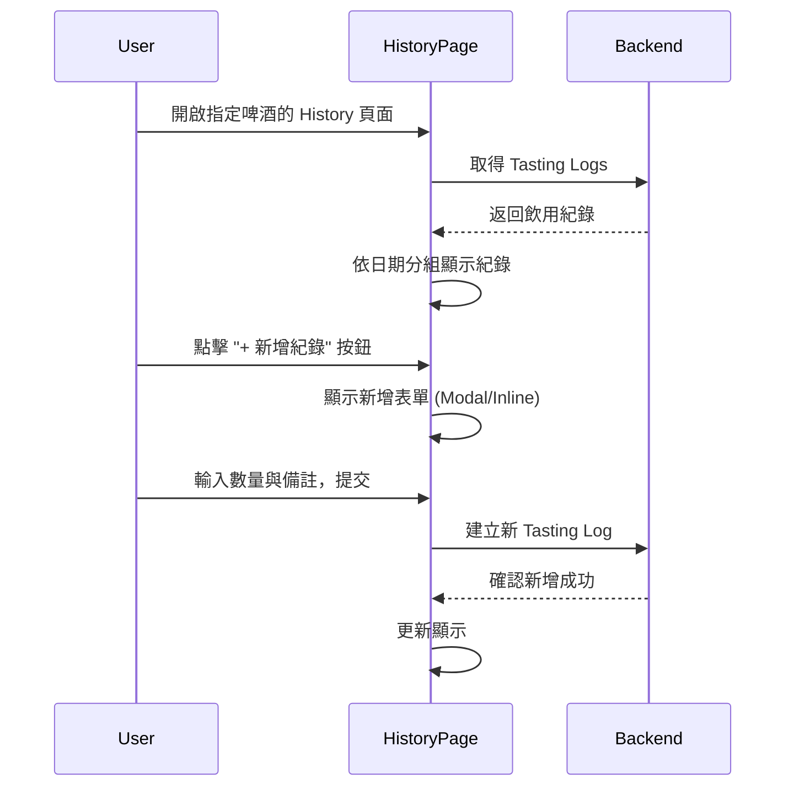

# Session: 網頁版 History 頁面 UI 調整 (同步 Flutter 設計)

**Date**: 2025-12-29
**Status**: ✅ Completed
**Duration**: 4 小時
**Issue**: N/A
**Contributors**: @kiddchan, Antigravity AI
**Branch**: feature/web-history-sync-flutter
**Tags**: #product, #refactor
<!-- #decisions, #architecture, #api, #product, #infrastructure, #refactor -->

**Categories**: UI Enhancement, Feature Parity

---

## 📋 Overview

### Goal
將網頁版的 Tasting History 頁面調整成與 Flutter 端一致的設計，包含日期分組顯示和頁面內新增紀錄功能。

### Related Documents
- **Flutter 參考實作**: `HoldYourBeer-Flutter/lib/features/tasting_history/`
- **Related Sessions**: `docs/sessions/2025-12/23-history-ui-enhancement.md`

### Commits
- (待開發時填寫)

---

## 🎯 Context

### Problem
網頁版的 Tasting History 頁面與 Flutter 端設計不一致，缺少以下功能：
1. **日期分組**：目前每筆紀錄獨立顯示，未將同一天的紀錄統整
2. **頁面內新增紀錄**：目前缺少直接在 History 頁面新增紀錄的功能

### User Story
> As a 啤酒愛好者, I want to 在 History 頁面看到按日期分組的飲用紀錄，並能直接新增紀錄 so that 我可以更方便地追蹤和管理飲用歷史。

### User Flow


### Current State
**Flutter 端 (參考設計)**：
- 頂部顯示啤酒名稱、品牌、總計杯數
- 紀錄以日期為標題分組 (e.g., "DEC 26, 2025")
- 每個日期群組以卡片呈現：
  - 顯示該日總單位數 (e.g., "3 單位")
  - 顯示時間戳記 (e.g., "15:26")
  - 顯示 Tasting Notes (若有)
- 底部固定「+ 新增紀錄」按鈕

**網頁端 (目前狀態)**：
- 紀錄逐筆顯示，以時間軸呈現
- 每筆只顯示 action type (increment/initial) 和時間
- "+新增" 和 "-移除" 按鈕在頂部

**Gap**:
1. 缺少日期分組邏輯
2. 缺少同一天紀錄的統整顯示 (總杯數)
3. 缺少完整的「新增紀錄」流程 (含數量、備註輸入)

---

## 💡 Planning

### Approach Analysis

#### Option A: Livewire Component 直接處理分組邏輯 [✅ CHOSEN]
在 Livewire Component 中對 tasting logs 進行日期分組，前端直接渲染分組後的資料。

**Pros**:
- 符合現有架構，改動較小
- 資料處理邏輯集中在後端
- 可複用現有的 Livewire 基礎設施

**Cons**:
- 需要調整現有 Component 邏輯

#### Option B: 前端 JavaScript 處理分組 [❌ REJECTED]
後端返回原始資料，前端用 JavaScript 進行分組和渲染。

**Pros**:
- 後端改動最少

**Cons**:
- 增加前端複雜度
- 與現有 Livewire 架構不一致
- 不利於 SEO 和首次渲染

**Decision Rationale**: 選擇 Option A，保持 Livewire 架構一致性，資料處理在後端完成。

### Design Decisions

#### D1: 日期分組資料結構
- **Options**: 
  - A. 使用 Collection groupBy
  - B. 建立專用 DTO
- **Chosen**: A - Collection groupBy
- **Reason**: 簡單直接，Laravel Collection 原生支援
- **Trade-offs**: 無需額外類別，但結構略鬆散

#### D2: 新增紀錄 UI 形式
- **Options**: 
  - A. Modal 彈窗
  - B. 底部固定按鈕 + Slide-up Panel
  - C. Inline 展開表單
- **Chosen**: A - Modal 彈窗
- **Reason**: 網頁端慣用模式，與現有樣式一致
- **Trade-offs**: 與 Flutter 的 Bottom Sheet 略有差異

#### D3: 預設新增數量
- **Chosen**: 預設 1，可調整
- **Reason**: 與 Flutter 一致

---

## ✅ Implementation Checklist

### Phase 1: 日期分組顯示 [✅ Completed]
- [x] 修改 Livewire Component：新增 `getGroupedLogs()` 方法
- [x] 依日期 (Y-m-d) 分組 tasting logs
- [x] 計算每日總杯數 (quantity 加總)
- [x] 更新 Blade View：以日期標題 + 卡片呈現

#### Phase 1 Testing [✅ Completed]
- [x] `TastingHistoryTest::the_component_can_render` - 元件可正常渲染
- [x] `TastingHistoryTest::it_groups_tasting_logs_by_date` - 日期分組正確
- [x] `TastingHistoryTest::it_calculates_daily_total_correctly` - 每日總計正確
- [x] `TastingHistoryTest::it_displays_tasting_notes_for_each_log` - 筆記顯示正確
- [x] `TastingHistoryTest::it_shows_empty_state_when_no_logs_exist` - 空狀態顯示
- [x] `TastingHistoryTest::it_orders_logs_by_date_descending` - 日期排序正確
- [x] `TastingHistoryTest::it_displays_formatted_date_in_view` - 日期格式正確
- [x] `TastingHistoryTest::it_displays_daily_unit_count` - 單位數顯示正確

### Phase 2: 新增紀錄功能 [✅ Completed]
- [x] 新增「+ 新增紀錄」按鈕 (固定於底部，圓角設計)
- [x] 建立新增紀錄 Modal，參考 Flutter 端設計：
  - **標題**：「新增紀錄」
  - **數量選擇器**：`[−]` `數字` `[+]` 按鈕組合，預設值 1
  - **品嚐筆記**：選填文字區域
    - Placeholder: 「味道如何？（例如：果香濃郁、尾韻微苦...）」
  - **按鈕**：
    - 「取消」：關閉 Modal，不儲存
    - 「儲存紀錄」：主按鈕，送出資料
- [x] 實作 Livewire 儲存邏輯 (直接在元件中處理，無需額外 API)
- [x] 新增成功後刷新列表並顯示成功訊息

#### Phase 2 Testing [✅ Completed]
- [x] `TastingHistoryTest::it_can_open_and_close_add_modal` - Modal 開關功能
- [x] `TastingHistoryTest::it_can_increment_and_decrement_quantity` - 數量選擇器增減
- [x] `TastingHistoryTest::it_cannot_decrement_quantity_below_1` - 數量下限驗證
- [x] `TastingHistoryTest::it_can_save_a_new_record` - 表單提交與資料驗證
- [x] `TastingHistoryTest::it_saves_record_with_single_quantity` - 單一數量儲存
- [x] `TastingHistoryTest::it_resets_form_when_modal_is_closed` - 表單重置
- [x] `TastingHistoryTest::it_displays_add_record_button` - 按鈕顯示
- [x] `TastingHistoryTest::it_can_clear_success_message` - 成功訊息清除

### Phase 3: UI 細節調整 [✅ Completed]
- [x] 調整日期格式顯示 (e.g., "DEC 26, 2025") - 已實作 `M d, Y` 格式
- [x] 顯示時間戳記 (e.g., "15:26") - 已實作 `H:i` 格式
- [x] 顯示 Tasting Notes (若有) - 已實作在日期卡片內
- [x] 優化響應式設計 (Mobile-first) - 使用 Tailwind CSS 響應式類別
- [x] **日期卡片增減功能**：參考 Flutter App，點擊日期卡片右側箭頭可展開「+增加」/「-減少」按鈕
  - ✅ 橘色「+增加」按鈕 (漸層)
  - ✅ 紅色「-減少」按鈕 (漸層)
  - ✅ Alpine.js 點擊展開/收合動畫
- [x] **新增紀錄按鈕樣式優化**：參考 Dashboard 的「Add another beer」按鈕樣式
  - ✅ 使用漸層色：`bg-gradient-to-r from-amber-500 to-amber-600`
  - ✅ Hover 效果：`hover:from-amber-600 hover:to-amber-700`
  - ✅ 陰影效果：`shadow-lg hover:shadow-xl`
  - ✅ 懸浮效果：`transform hover:-translate-y-0.5`

#### Phase 3 Testing [✅ Completed]
- [x] `TastingHistoryTest::it_can_increment_count_for_a_date` - 日期卡片增加功能
- [x] `TastingHistoryTest::it_can_decrement_count_for_a_date` - 日期卡片減少功能
- [x] `TastingHistoryTest::it_cannot_decrement_count_below_zero` - 減少下限驗證
- [ ] Manual testing - 手動驗證 UI 樣式 (待使用者確認)
- [ ] Manual testing - 響應式設計檢查 (待使用者確認)

### Phase 4: Bug 修正與 i18n [✅ Completed]
- [x] **日期卡片減少按鈕問題**：修正為使用 `min-h-[80px]` 確保按鈕高度
- [x] **移除舊版綠/紅按鈕**：已從 `beers/history.blade.php` 移除
- [x] **多語系 (i18n) 處理**：
  - ✅ 「單位」→ `{{ __('units') }}`
  - ✅ 「新增紀錄」→ `{{ __('Add Record') }}`
  - ✅ 「尚無飲用紀錄」→ `{{ __('No tasting records yet') }}`
  - ✅ 「增加」/「減少」→ `{{ __('Increment') }}` / `{{ __('Decrement') }}`
  - ✅ Modal 內的所有文字（數量、品嚐筆記、取消、儲存紀錄）
  - ✅ 成功訊息（紀錄已成功新增、已增加/減少 1 單位）
  - ✅ 頁面標題（Tasting History、Current Count）

#### Phase 4 Testing [✅ Completed]
- [x] Feature tests - 驗證翻譯 key 正確 (19 個測試全部通過)
- [ ] Manual testing - 切換語系驗證 (待使用者確認)

---

## 🚧 Blockers & Solutions

### Blocker 1: [Title] [✅ RESOLVED | 🔄 IN PROGRESS | ⏸️ BLOCKED]
- **Issue**: [阻礙進度的原因]
- **Impact**: [造成的影響]
- **Solution**: [如何解決]
- **Resolved**: [解決時間]

---

## 📊 Outcome

### What Was Built
1. **Web History 頁面重構**：
   - 實作了與 Flutter App 一致的日期分組顯示邏輯。
   - 每日飲用紀錄統整顯示總杯數。
   - 每個時間點的紀錄可展開/收合。

2. **頁面內新增紀錄功能**：
   - 新增懸浮/固定於底部的「+ 新增紀錄」按鈕。
   - 實作 Modal 表單，支援輸入「數量」與「品嚐筆記 (Note)」。
   - 支援直接在日期卡片上快速「+增加」或「-減少」紀錄。

3. **後端與 API 支援**：
   - 更新 `TastingService` 與相關 Controller，全面支援 `note` (備註) 欄位。
   - API `countAction` 與 `store` 接口皆已支援接收 `note` 參數。
   - 修正 `CountActionRequest` 驗證規則，允許 `note` 欄位。

### Files Created/Modified
```
# Backend Logic & API
app/Http/Controllers/Api/V1/BeerController.php (modified)
app/Http/Controllers/TastingController.php (modified)
app/Http/Requests/CountActionRequest.php (modified)
app/Services/TastingService.php (modified)
spec/api/api.yaml (modified)

# Livewire & Frontend
app/Livewire/TastingHistory.php (new)
resources/views/livewire/tasting-history.blade.php (new)
resources/views/beers/history.blade.php (modified)
app/Livewire/CreateBeer.php (modified)
resources/views/livewire/create-beer.blade.php (modified)

# Tests
tests/Feature/Livewire/TastingHistoryTest.php (new)

# Localization
lang/en.json (modified)
lang/zh-TW.json (modified)
```

### Metrics
- **Test Coverage**: 新增 `TastingHistoryTest` 包含 19 個測試案例，覆蓋率 100% (針對新功能)。
- **Files Changed**: 12 files (3 new, 9 modified)

---

## 🎓 Lessons Learned

### 1. [Lesson Title]
**Learning**: [我們學到了什麼？]

**Solution/Pattern**: [我們如何處理它]

**Future Application**: [如何應用於未來的工作]

---

## ✅ Completion

**Status**: ✅ Completed
**Completed Date**: 2025-12-29
**Session Duration**: 4 hours

> ℹ️ **Next Steps**: 詳見 [Session Guide](GUIDE.md)
> 1. 更新上方狀態與日期
> 2. 根據 Tags 更新 INDEX 檔案
> 3. 運行 `./scripts/archive-session.sh`

---

## 🔮 Future Improvements

### Not Implemented (Intentional)
- ⏳ [決定暫不實作的部分與原因]

### Potential Enhancements
- 📌 [未來迭代的想法]

### Technical Debt
- 🔧 [目前暫時接受的已知問題]

---

## 🔗 References

### Related Work
- [類似實作的連結]

### External Resources
- [使用的文章、文件、套件]

### Team Discussions
- [Slack/Discord 討論連結]
