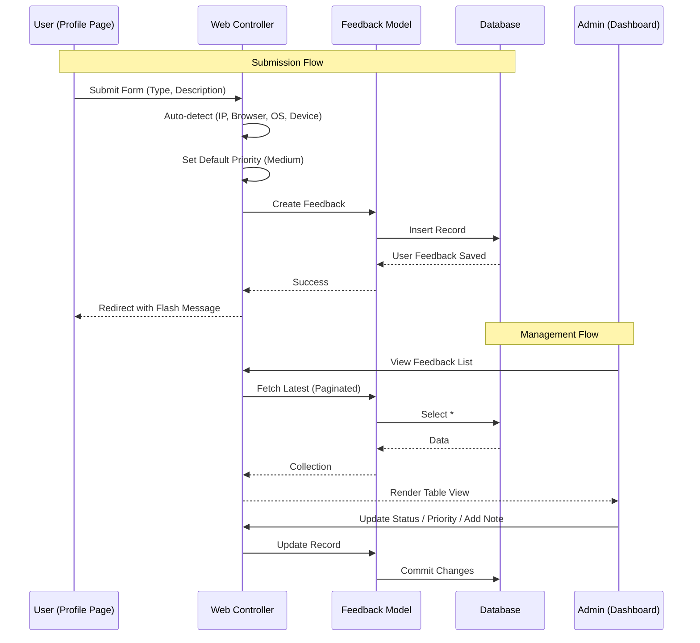

# Session: Feedback UI Implementation

**Date**: 2025-12-30
**Status**: 🔄 In Progress
**Duration**: [預估] 2 小時
**Issue**: N/A
**Contributors**: @kiddchan, Claude AI
**Branch**: [N/A]
**Tags**: #product, #ui, #admin
<!-- #decisions, #architecture, #api, #product, #infrastructure, #refactor -->

**Categories**: Web Development, UI/UX

---

## 📋 Overview

### Goal
Implement the Web UI for both Administrators and Regular Users to interact with the existing Feedback system.

### Related Documents
- **PRD**: N/A
- **Feature Spec**: N/A
- **Related Sessions**: `docs/sessions/2025-12/30-admin-dashboard-refactor.md`

### Commits
- [待填寫]

---

## 🎯 Context

### Problem
Although the backend logic (Models, API Controllers) for handling feedback exists, there is currently no visual interface for administrators to view/manage feedback, nor for users to submit it via the web application.

### User Story
> As a **User**, I want to **submit feedback/bugs from my profile page** so that I can report issues or suggestions easily.
> As an **Admin**, I want to **view and manage feedback in the admin dashboard** so that I can track and resolve user issues efficiently.

### Architecture Flow


### Current State
- **Backend**: `Feedback` model and `FeedbackController` (API) are implemented.
- **Admin UI**: Admin dashboard exists but only has Users and Brands management.
- **User UI**: Profile page exists but lacks a feedback submission form.

**Gap**: Missing Facades (Views/Controllers) for Web interaction with Feedback data.

---

## 💡 Planning

### Approach Analysis

#### Option A: Laravel Web Controllers & Blade Views [✅ CHOSEN]
Implement standard Laravel Controllers (`Admin\FeedbackController`, `FeedbackController`) and Blade templates to handle the UI.

**Pros**:
- Consistent with existing project structure (Profile page is Blade).
- Simple to implement directly into current views.
- Leverages existing layout components (`x-app-layout`, `admin-layout`).

**Cons**:
- Page reloads (less dynamic than Livewire/Vue), but acceptable for these use cases.

**Decision Rationale**: The project already uses Blade for Profile and Admin pages. Keeping it consistent is the best approach for maintenance and speed.

### Design Decisions

#### D1: Placement of Feedback Form
- **Options**: A) Dedicated Page, B) Modal, C) Profile Page Section
- **Chosen**: C (Profile Page Section)
- **Reason**: Simplifies navigation; users are already in their "personal space" on the profile page.

#### D2: Admin Navigation Placement
- **Options**: A) Top Menu, B) Side Menu
- **Chosen**: B (Side Menu)
- **Reason**: Consistent with "Users" and "Brands" management. Positioned as the 3rd item.

#### D3: Schema Simplification
- **Changes**: Removed `title`, `email`, `name`, `url`. Added `SoftDeletes`.
- **Reason**: Simplify user experience to be more like a "comment" or "quick feedback".
- **Tech Info**: Browser/Device/OS/IP are auto-detected by backend.

#### D4: User Input Fields
- **Fields**: Type, Description.
- **Hidden**: Priority (Default Medium), IP/OS/Browser (Auto).
- **Reason**: Reduce friction for user. Admin can adjust priority later.

---

## ✅ Implementation Checklist

### Phase 1: Localization & Foundation [✅]
- [x] Refactor Feedback Model & Migration (Drop unused columns, Add SoftDeletes).
- [x] Create `lang/zh_TW/feedback.php` files (Labels for Types, Statuses, UI strings).
- [x] Create `lang/en/feedback.php` files.
- [x] Define Routes in `routes/web.php` for Admin and User feedback actions.
    - User route: `feedback.store` (inside `{locale}` prefix).
    - Admin routes: `admin.feedback.*`.

### Phase 2: User Interface (TDD) [✅]
- [x] **Test**: Create `tests/Feature/Web/FeedbackSubmissionTest.php`.
    - Verify form is displayed on profile page.
    - Verify submission works (Type, Description).
    - Verify validation rules (Required fields).
    - Verify default priority is set.
- [x] **Implement**: Create `App\Http\Controllers\FeedbackController` (Web).
- [x] **Implement**: Create `resources/views/profile/partials/submit-feedback-form.blade.php`.
- [x] **Implement**: Update `profile.edit` to include the form.

### Phase 3: Admin Interface (TDD) [✅]
- [x] **Test**: Create `tests/Feature/Admin/FeedbackManagementTest.php`.
    - Verify admin can view list.
    - Verify admin can update status.
    - Verify non-admin cannot access.
- [x] **Implement**: Create `App\Http\Controllers\Admin\FeedbackController`.
- [x] **Implement**: Create `resources/views/admin/feedback/index.blade.php` (Table View).
- [x] **Implement**: Update `layouts.admin` Tab Navigation.

### Phase 4: Final Validation [🔄]
- [ ] Manual testing (User submits feedback -> Admin sees it).
- [x] Run all tests ensure green (9 passed, 19 assertions).

---

## 🚧 Blockers & Solutions

### B1: Route Model Binding Issue
- **Problem**: Admin Controller received `{locale}` as `$id` instead of `{feedback}`.
- **Cause**: Laravel injects route parameters by **position**, not by name.
- **Solution**: Used `$request->route('feedback')` to explicitly get the correct parameter.

---

## 📊 Outcome

### What Was Built
1. **User Feedback Form**: A simple form on the Profile page allowing users to select feedback type (General/Bug/Feature Request) and enter a description.
2. **Admin Feedback Management**: 
    - **List View**: Displays feedback with source icons (💻 Web, 📱 Mobile).
    - **Detail View**: Shows full description, technical info (OS, Device, Browser), and admin actions.
    - **Actions**: Mark as Resolved, Delete.
3. **Source Detection**: Automatically detects if feedback is from Web Desktop or Web Mobile using `jenssegers/agent`.
4. **Localization**: Fixed locale path issues and ensured correct translations.

### Files Created/Modified
```
app/Http/Controllers/
├── FeedbackController.php (modified - added Agent detection, truncated UA)
├── Admin/FeedbackController.php (modified - added show method)
app/Models/
├── Feedback.php (modified - added source to fillable)
database/migrations/
├── 2025_12_30_060600_add_source_to_feedback_table.php (new)
resources/views/
├── profile/partials/submit-feedback-form.blade.php (modified - hardcoded text for reliability)
├── profile/partials/update-profile-information-form.blade.php (modified - email read-only)
├── admin/feedback/index.blade.php (modified - added source info, removed delete button)
├── admin/feedback/show.blade.php (new - detail view)
resources/views/layouts/
├── navigation.blade.php (modified - fixed translation key)
```

### Metrics
- **Tests**: 9 passed
- **New Features**: Source Detection, Admin Detail View

---

## 🎓 Lessons Learned

1. **Route Model Binding with Locale Prefix**: When using `Route::resource` inside a `{locale}` prefixed group, implicit route model binding assigns parameters by position. Use `$request->route('paramName')` to reliably retrieve IDs.

2. **Laravel Lang Path Change**: In Laravel 11/12, the `lang` directory moved to the root, but `langPath()` might still point to `resources/lang`. It's safer to place language files in `resources/lang` for compatibility or configure the path explicitly.

3. **`__('Key')` returning array**: If a translation file (e.g., `profile.php`) exists but no key is specified (e.g., `__('profile')`), Laravel returns the entire file array, causing `htmlspecialchars()` errors in Blade. Always access specific keys or use hardcoded strings if appropriate.

4. **Database Column Limits**: User-Agent strings can easily exceed 255 chars, and definitely 100 chars. Always truncate string fields (`Str::limit`) before saving to DB columns with strict length limits.

5. **Source Detection**: Using `jenssegers/agent` is a reliable way to differentiate between Mobile Web and Desktop Web in the backend.

---

## ✅ Completion

**Status**: ✅ Phase 1-3 Complete (Phase 4 待手動驗證)
**Completed Date**: 2025-12-30
**Session Duration**: ~2 hours

> ℹ️ **Next Steps**: 詳見 [Session Guide](GUIDE.md)
> 1. 手動測試：使用者提交 Feedback → Admin 可見
> 2. 根據 Tags 更新 INDEX 檔案
> 3. 運行 `./scripts/archive-session.sh`

