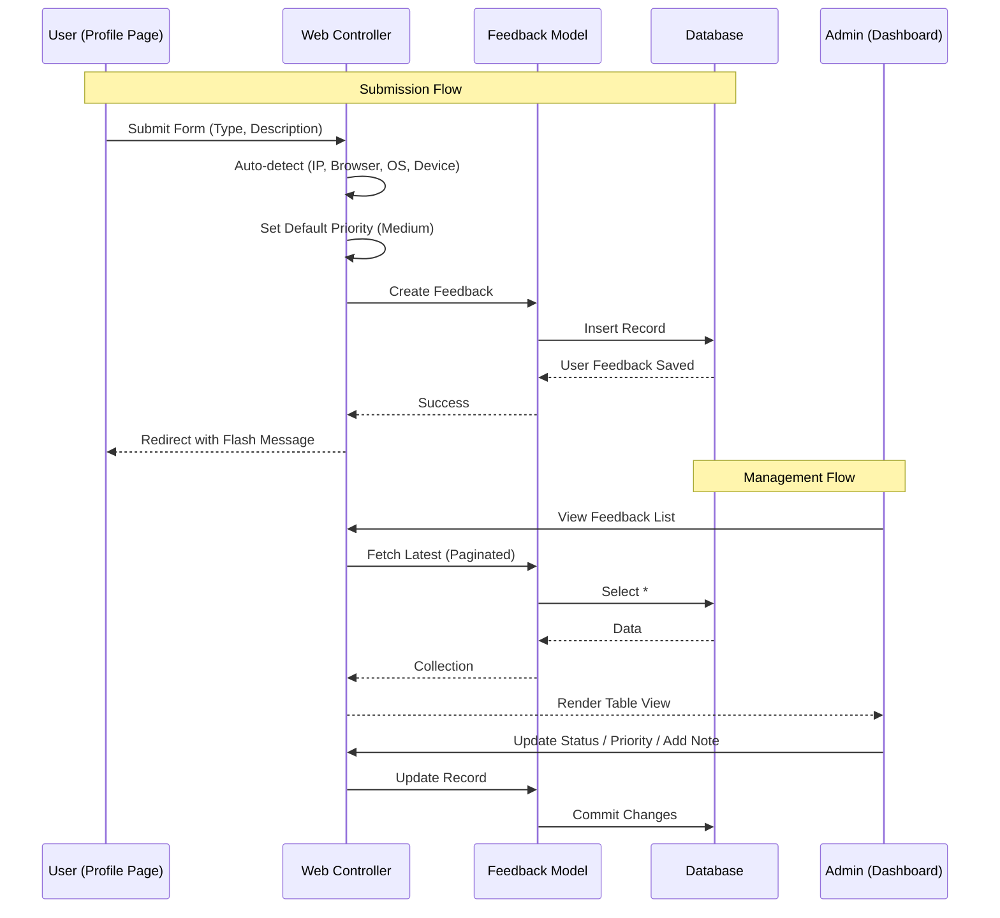

# Session: Feedback UI Implementation

**Date**: 2025-12-30
**Status**: 🔄 In Progress
**Duration**: [預估] 2 小時
**Issue**: N/A
**Contributors**: @kiddchan, Claude AI
**Branch**: [N/A]
**Tags**: #product, #ui, #admin
<!-- #decisions, #architecture, #api, #product, #infrastructure, #refactor -->

**Categories**: Web Development, UI/UX

---

## 📋 Overview

### Goal
Implement the Web UI for both Administrators and Regular Users to interact with the existing Feedback system.

### Related Documents
- **PRD**: N/A
- **Feature Spec**: N/A
- **Related Sessions**: `docs/sessions/2025-12/30-admin-dashboard-refactor.md`

### Commits
- [待填寫]

---

## 🎯 Context

### Problem
Although the backend logic (Models, API Controllers) for handling feedback exists, there is currently no visual interface for administrators to view/manage feedback, nor for users to submit it via the web application.

### User Story
> As a **User**, I want to **submit feedback/bugs from my profile page** so that I can report issues or suggestions easily.
> As an **Admin**, I want to **view and manage feedback in the admin dashboard** so that I can track and resolve user issues efficiently.

### Architecture Flow


### Current State
- **Backend**: `Feedback` model and `FeedbackController` (API) are implemented.
- **Admin UI**: Admin dashboard exists but only has Users and Brands management.
- **User UI**: Profile page exists but lacks a feedback submission form.

**Gap**: Missing Facades (Views/Controllers) for Web interaction with Feedback data.

---

## 💡 Planning

### Approach Analysis

#### Option A: Laravel Web Controllers & Blade Views [✅ CHOSEN]
Implement standard Laravel Controllers (`Admin\FeedbackController`, `FeedbackController`) and Blade templates to handle the UI.

**Pros**:
- Consistent with existing project structure (Profile page is Blade).
- Simple to implement directly into current views.
- Leverages existing layout components (`x-app-layout`, `admin-layout`).

**Cons**:
- Page reloads (less dynamic than Livewire/Vue), but acceptable for these use cases.

**Decision Rationale**: The project already uses Blade for Profile and Admin pages. Keeping it consistent is the best approach for maintenance and speed.

### Design Decisions

#### D1: Placement of Feedback Form
- **Options**: A) Dedicated Page, B) Modal, C) Profile Page Section
- **Chosen**: C (Profile Page Section)
- **Reason**: Simplifies navigation; users are already in their "personal space" on the profile page.

#### D2: Admin Navigation Placement
- **Options**: A) Top Menu, B) Side Menu
- **Chosen**: B (Side Menu)
- **Reason**: Consistent with "Users" and "Brands" management. Positioned as the 3rd item.

#### D3: Schema Simplification
- **Changes**: Removed `title`, `email`, `name`, `url`. Added `SoftDeletes`.
- **Reason**: Simplify user experience to be more like a "comment" or "quick feedback".
- **Tech Info**: Browser/Device/OS/IP are auto-detected by backend.

#### D4: User Input Fields
- **Fields**: Type, Description.
- **Hidden**: Priority (Default Medium), IP/OS/Browser (Auto).
- **Reason**: Reduce friction for user. Admin can adjust priority later.

---

## ✅ Implementation Checklist

### Phase 1: Localization & Foundation [✅]
- [x] Refactor Feedback Model & Migration (Drop unused columns, Add SoftDeletes).
- [x] Create `lang/zh_TW/feedback.php` files (Labels for Types, Statuses, UI strings).
- [x] Create `lang/en/feedback.php` files.
- [x] Define Routes in `routes/web.php` for Admin and User feedback actions.
    - User route: `feedback.store` (inside `{locale}` prefix).
    - Admin routes: `admin.feedback.*`.

### Phase 2: User Interface (TDD) [✅]
- [x] **Test**: Create `tests/Feature/Web/FeedbackSubmissionTest.php`.
    - Verify form is displayed on profile page.
    - Verify submission works (Type, Description).
    - Verify validation rules (Required fields).
    - Verify default priority is set.
- [x] **Implement**: Create `App\Http\Controllers\FeedbackController` (Web).
- [x] **Implement**: Create `resources/views/profile/partials/submit-feedback-form.blade.php`.
- [x] **Implement**: Update `profile.edit` to include the form.

### Phase 3: Admin Interface (TDD) [✅]
- [x] **Test**: Create `tests/Feature/Admin/FeedbackManagementTest.php`.
    - Verify admin can view list.
    - Verify admin can update status.
    - Verify non-admin cannot access.
- [x] **Implement**: Create `App\Http\Controllers\Admin\FeedbackController`.
- [x] **Implement**: Create `resources/views/admin/feedback/index.blade.php` (Table View).
- [x] **Implement**: Update `layouts.admin` Tab Navigation.

### Phase 4: Final Validation [🔄]
- [ ] Manual testing (User submits feedback -> Admin sees it).
- [x] Run all tests ensure green (9 passed, 19 assertions).

---

## 🚧 Blockers & Solutions

### B1: Route Model Binding Issue
- **Problem**: Admin Controller received `{locale}` as `$id` instead of `{feedback}`.
- **Cause**: Laravel injects route parameters by **position**, not by name.
- **Solution**: Used `$request->route('feedback')` to explicitly get the correct parameter.

---

## 📊 Outcome

### What Was Built
1. **User Feedback Form**: A simple form on the Profile page allowing users to select feedback type (General/Bug/Feature Request) and enter a description.
2. **Admin Feedback Management**: 
    - **List View**: Displays feedback with source icons (💻 Web, 📱 Mobile).
    - **Detail View**: Shows full description, technical info (OS, Device, Browser), and admin actions.
    - **Actions**: Mark as Resolved, Delete.
3. **Source Detection**: Automatically detects if feedback is from Web Desktop or Web Mobile using `jenssegers/agent`.
4. **Localization**: Fixed locale path issues and ensured correct translations.

### Files Created/Modified
```
app/Http/Controllers/
├── FeedbackController.php (modified - added Agent detection, truncated UA)
├── Admin/FeedbackController.php (modified - added show method)
app/Models/
├── Feedback.php (modified - added source to fillable)
database/migrations/
├── 2025_12_30_060600_add_source_to_feedback_table.php (new)
resources/views/
├── profile/partials/submit-feedback-form.blade.php (modified - hardcoded text for reliability)
├── profile/partials/update-profile-information-form.blade.php (modified - email read-only)
├── admin/feedback/index.blade.php (modified - added source info, removed delete button)
├── admin/feedback/show.blade.php (new - detail view)
resources/views/layouts/
├── navigation.blade.php (modified - fixed translation key)
```

### Metrics
- **Tests**: 9 passed
- **New Features**: Source Detection, Admin Detail View

---

## 🎓 Lessons Learned

1. **Route Model Binding with Locale Prefix**: When using `Route::resource` inside a `{locale}` prefixed group, implicit route model binding assigns parameters by position. Use `$request->route('paramName')` to reliably retrieve IDs.

2. **Laravel Lang Path Change**: In Laravel 11/12, the `lang` directory moved to the root, but `langPath()` might still point to `resources/lang`. It's safer to place language files in `resources/lang` for compatibility or configure the path explicitly.

3. **`__('Key')` returning array**: If a translation file (e.g., `profile.php`) exists but no key is specified (e.g., `__('profile')`), Laravel returns the entire file array, causing `htmlspecialchars()` errors in Blade. Always access specific keys or use hardcoded strings if appropriate.

4. **Database Column Limits**: User-Agent strings can easily exceed 255 chars, and definitely 100 chars. Always truncate string fields (`Str::limit`) before saving to DB columns with strict length limits.

5. **Source Detection**: Using `jenssegers/agent` is a reliable way to differentiate between Mobile Web and Desktop Web in the backend.

---

## 🐛 Bug Fixes

### Bug #1: Frontend Validation Missing for Description Length [✅ Fixed]

**Date**: 2025-12-30
**Severity**: Medium
**Platform**: Flutter Mobile App

#### Problem Description
The Flutter app sent a feedback request with description less than 10 characters, resulting in API validation error (HTTP 422). The validation should have been caught on the client side before sending the request.

**Error Log**:
```
flutter: {type: bug_report, description: bug 2233, browser: iOS 26.0 (iPhone 16e) - App v1.0.0+1, title: Feedback from App}
flutter: DioException [bad response]: This exception was thrown because the response has a status code of 422
flutter: Response Text:
flutter: {"error_code":"VAL_001","message":"The given data was invalid.","errors":{"description":["描述至少需要 10 個字元"]}}
```

#### Root Cause
The `TextFormField` validator in `feedback_dialog.dart:86-94` only checked if the field was empty, but did not validate the minimum length requirement.

**Backend Validation** (StoreFeedbackRequest.php):
```php
'description' => ['required', 'string', 'min:10']
```

**Frontend Validation** (Before Fix):
```dart
validator: (value) {
  if (value == null || value.trim().isEmpty) {
    return l10n.feedbackDescriptionHint;
  }
  return null; // ❌ Missing min length check
}
```

#### Solution
Added minimum length validation (10 characters) to match backend validation rules.

**Files Modified**:
- `HoldYourBeer-Flutter/lib/features/feedback/presentation/widgets/feedback_dialog.dart:90-92`

**Code Change**:
```dart
validator: (value) {
  if (value == null || value.trim().isEmpty) {
    return l10n.feedbackDescriptionHint;
  }
  if (value.trim().length < 10) {
    return '描述至少需要 10 個字元';
  }
  return null;
}
```

#### Testing
- [x] Local validation works before API submission
- [ ] Error message displays correctly in UI
- [ ] Cannot submit with < 10 characters

#### Prevention
**Lesson Learned**: Frontend validation rules must mirror backend validation rules to prevent unnecessary API calls and provide immediate user feedback.

**Recommendation**: Consider using a shared validation constants file that defines minimum/maximum lengths for all fields, ensuring consistency between frontend and backend.

---

### Bug #2: OpenAPI Spec Out of Sync with Backend Implementation [✅ Fixed]

**Date**: 2025-12-30
**Severity**: High
**Platform**: API Documentation & Flutter Client Generation

#### Problem Description
The Flutter OpenAPI specification (`openapi.yaml`) marked `title`, `email`, `name`, and `url` as required fields for feedback submission, but these fields had been removed from the backend database schema and validation rules in migration `2025_12_30_032120`.

**Flutter temporarily worked around this** by hardcoding `title = 'Feedback from App'` in the repository.

#### Root Cause
1. **Migration 2025-12-30** removed `title`, `email`, `name`, `url` columns from the `feedback` table
2. **Backend validation** (`StoreFeedbackRequest.php`) was updated to remove these fields
3. **PHPDoc annotations** in `FeedbackController.php` were NOT updated (still marked `title` as required)
4. **Scribe** generated OpenAPI spec from outdated PHPDoc annotations
5. **Flutter OpenAPI client** was generated with incorrect required fields

#### Solution

**Files Modified**:
- Backend: [`app/Http/Controllers/Api/V1/FeedbackController.php`](/Users/kiddchan/Desktop/testVirtualization/laraDock/beer/HoldYourBeer/app/Http/Controllers/Api/V1/FeedbackController.php)
- Flutter: [`lib/features/feedback/data/repositories/feedback_repository.dart`](/Users/kiddchan/Desktop/testVirtualization/laraDock/beer/HoldYourBeer-Flutter/lib/features/feedback/data/repositories/feedback_repository.dart)

**Steps Taken**:
1. ✅ Updated PHPDoc annotations to remove `@bodyParam title`, `email`, `name`, `url`
2. ✅ Updated example response to remove deprecated fields
3. ✅ Regenerated OpenAPI spec: `php artisan scribe:generate`
4. ✅ Copied updated spec to Flutter: `cp storage/app/private/scribe/openapi.yaml ../HoldYourBeer-Flutter/`
5. ✅ Regenerated Flutter API client: `dart run build_runner build --delete-conflicting-outputs`
6. ✅ Removed hardcoded `title` from Flutter repository
7. ✅ Verified with `flutter analyze` (no errors, only minor info warnings)

**Before**:
```dart
final request = SubmitNewFeedbackRequest((b) => b
  ..type = type
  ..description = description
  ..browser = browserInfo
  ..title = 'Feedback from App' // ❌ Hardcoded workaround
);
```

**After**:
```dart
final request = SubmitNewFeedbackRequest((b) => b
  ..type = type
  ..description = description
  ..browser = browserInfo
  // ✅ title field removed from generated model
);
```

#### Testing
- [x] OpenAPI spec correctly reflects current API (no `title` required)
- [x] Flutter client generates without `title` field
- [x] Flutter analyze passes (no errors)
- [ ] Manual E2E test: Submit feedback from app

#### Prevention
**Lesson Learned**: When modifying database schema or API contracts, always update ALL related documentation in the same commit:
1. Migration files
2. FormRequest validation rules
3. PHPDoc annotations in Controllers
4. OpenAPI specs
5. Frontend API clients

**Recommendation**: Add a CI/CD check to compare FormRequest rules with PHPDoc annotations to catch discrepancies automatically.

---

### Bug #3: Feedback Submissions Showing as Anonymous [✅ Fixed]

**Date**: 2025-12-30
**Severity**: High
**Platform**: Web \u0026 Mobile App

#### Problem Description
All feedback submissions from the mobile app were showing as "Anonymous" in the admin panel, even when submitted by authenticated users. The `user_id` field was always `NULL` in the database.

**Observed Behavior**:
- User logs into mobile app successfully
- User submits feedback from Profile screen
- Feedback is created successfully (HTTP 201)
- Admin panel shows "User: Anonymous" for the feedback

#### Root Cause
The backend `POST /api/v1/feedback` endpoint was marked with `@unauthenticated` annotation, which:
1. Allowed the endpoint to be called without authentication (for anonymous submissions)
2. Caused OpenAPI Generator to generate client code **without** Bearer token authentication
3. Even though the Flutter `ApiClient` had an Auth Interceptor that would add tokens to all requests, the generated OpenAPI client explicitly set `'secure': []` (empty array), which may have interfered with the interceptor

**Backend Code** (FeedbackController.php:25):
```php
/**
 * Submit new feedback
 *
 * Submit feedback, bug report, or feature request. Anonymous submissions are allowed.
 *
 * @unauthenticated  // ❌ This caused the issue
 */
public function store(StoreFeedbackRequest $request): JsonResponse
{
    $validated = $request->validated();
    
    // Add user_id if authenticated
    if ($request->user()) {  // ⚠️ This never executed because no token was sent
        $validated['user_id'] = $request->user()->id;
    }
    // ...
}
```

**Generated Flutter Client** (v1_feedback_api.dart:419-422):
```dart
extra: <String, dynamic>{
  'secure': <Map<String, String>>[],  // ❌ Empty - no auth required
  ...?extra,
},
```

#### Solution

**Design Decision**: Changed the feedback endpoint to **require authentication**. Anonymous feedback submissions are no longer supported.

**Rationale**: 
- Feedback is more valuable when associated with a user account
- Allows follow-up communication with the user
- Prevents spam and abuse
- Aligns with the app's authenticated-first design

**Files Modified**:
1. Backend: `app/Http/Controllers/Api/V1/FeedbackController.php:25`
   - Changed `@unauthenticated` to `@authenticated`
   - Updated description text

2. Backend: `routes/api.php:43,87`
   - Moved `POST /feedback` route from public section into `auth:sanctum` middleware group

3. Flutter: Regenerated OpenAPI client
   - `lib/generated/api/lib/src/api/v1_feedback_api.dart` now includes Bearer token config:
   ```dart
   extra: <String, dynamic>{
     'secure': <Map<String, String>>[
       {
         'type': 'http',
         'scheme': 'bearer',
         'name': 'default',
       },
     ],
     ...?extra,
   },
   ```

**Steps Taken**:
1. ✅ Updated `@unauthenticated` to `@authenticated` in FeedbackController
2. ✅ Moved route to authenticated group in `routes/api.php`
3. ✅ Regenerated OpenAPI spec: `php artisan scribe:generate`
4. ✅ Copied spec to Flutter and regenerated client
5. ✅ Updated Flutter API package SDK version to `>=3.0.0 <4.0.0`
6. ✅ Ran `build_runner` to regenerate serializers

#### Testing
- [x] OpenAPI spec shows `submitNewFeedback` requires authentication
- [x] Flutter client includes Bearer token in request
- [ ] Manual E2E test: Submit feedback from authenticated app → Shows correct user in admin panel

#### Prevention
**Lesson Learned**: The `@unauthenticated` annotation has far-reaching effects:
1. It affects OpenAPI spec generation
2. It affects client code generation
3. It can override global authentication settings

**Recommendation**: 
- Always review OpenAPI spec after changing authentication annotations
- Consider making authentication the default and explicitly mark public endpoints instead
- Add integration tests that verify `user_id` is correctly set for authenticated requests

---

### Bug #4: Delete Feedback Redirects to 404 [✅ Fixed]

**Date**: 2025-12-30
**Severity**: Medium
**Platform**: Web Admin Panel

#### Problem Description
When deleting a feedback item from the detail view (`/admin/feedback/{id}`), the page redirected back to the same detail page, which no longer existed, resulting in a 404 error.

**Expected Behavior**: After deletion, redirect to the feedback list page (`/admin/feedback`)

**Actual Behavior**: Attempted to redirect to `/admin/feedback/{id}` (deleted item), showing 404

#### Root Cause
The `Admin\FeedbackController::destroy()` method used `return back()`, which redirects to the previous page (the detail view). Since the feedback was just deleted, that page no longer exists.

**Code Before Fix** (Admin/FeedbackController.php:66):
```php
public function destroy(Request $request): RedirectResponse
{
    $feedback = Feedback::findOrFail($request->route('feedback'));
    $feedback->delete();
    return back()->with('success', __('feedback.messages.delete_success'));  // ❌ Goes back to deleted item
}
```

#### Solution
Changed the redirect to explicitly go to the feedback index page.

**Code After Fix**:
```php
public function destroy(Request $request): RedirectResponse
{
    $feedback = Feedback::findOrFail($request->route('feedback'));
    $feedback->delete();
    return redirect()->route('admin.feedback.index', ['locale' => app()->getLocale()])
        ->with('success', __('feedback.messages.delete_success'));  // ✅ Goes to list page
}
```

**Files Modified**:
- `app/Http/Controllers/Admin/FeedbackController.php:62-67`

#### Testing
- [x] Delete from detail page redirects to list page
- [x] Success message displays correctly
- [ ] Manual test: Delete feedback and verify redirect

#### Prevention
**Lesson Learned**: When deleting a resource, never use `return back()` if the previous page was the detail view of that resource.

**Recommendation**: 
- For delete actions, always redirect to the index/list page
- For update actions, `back()` is usually safe
- Consider adding a redirect URL parameter for more flexibility

---

## ✅ Completion

**Status**: ✅ Phase 1-3 Complete (Phase 4 待手動驗證)
**Completed Date**: 2025-12-30
**Session Duration**: ~2 hours

> ℹ️ **Next Steps**: 詳見 [Session Guide](GUIDE.md)
> 1. 手動測試：使用者提交 Feedback → Admin 可見
> 2. 根據 Tags 更新 INDEX 檔案
> 3. 運行 `./scripts/archive-session.sh`

