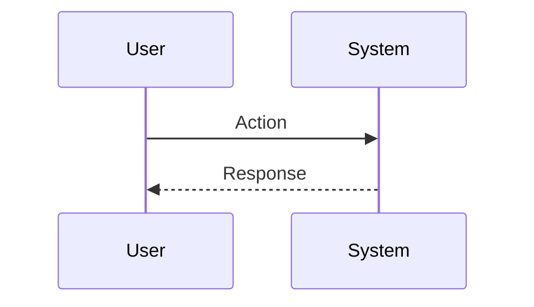

# Session: User Password Flow Fix

**Date**: 2026-01-06
**Status**: 🔄 In Progress
**Duration**: [預估/實際] 小時
**Issue**: #XX
**Contributors**: @kiddchan, Antigravity
**Tags**: #auth, #password, #fix
<!-- #decisions, #architecture, #api, #product, #infrastructure, #refactor -->

**Categories**: Authentication
<!-- 例如：State Management, API Integration -->

---

## 📋 Overview

### Goal
[一句話說明：修正使用者密碼流程中的問題]

### Related Documents
- **PRD**: [連結到 docs/product/PRD.md 或 features/]
- **Feature Spec**: [如果有，請提供連結]
- **Related Sessions**:
    - `HoldYourBeer-Flutter/docs/sessions/2026-01/05-flutter-oauth-password-logic.md`
    - `HoldYourBeer/docs/sessions/`

### Commits
- `commit message` (hash) - [開發過程中填寫]

---

## 🎯 Context

🎯 使用情境範例

  情境 1：一般註冊用戶忘記密碼

  1. 用戶點擊「忘記密碼」
  2. 輸入 Email：user@example.com
  3. 後端檢查：isLocalUser() = true, hasPassword() = true
  4. ✅ 發送重設郵件
  5. 用戶收到郵件，點擊連結
  6. 輸入新密碼並確認
  7. 密碼重設成功

  情境 2：Google 用戶（未設密碼）忘記密碼

  1. 用戶點擊「忘記密碼」
  2. 輸入 Email：google-user@gmail.com
  3. 後端檢查：isOAuthUser() = true, hasPassword() = false
  4. ❌ 不發送郵件
  5. 回應：may_require_oauth = true
  6. 前端顯示藍色提示卡：「您的帳號使用第三方登入」
  7. 提供按鈕「使用 Google 登入」
  8. 點擊後 **導向登入頁 (Login Screen)**，讓用戶進行 Google 登入

  情境 3：Google 用戶（已設密碼）忘記密碼（🔴 目前舊流程 - Old）

  1. 用戶點擊「忘記密碼」
  2. 輸入 Email：google-user@gmail.com
  3. 後端檢查：isOAuthUser() = true, hasPassword() = true
  4. ✅ 發送重設郵件（因為已設定過密碼）
  5. 後續流程同情境 1

  情境 3：Google 用戶（已設密碼）忘記密碼（🟢 預期新流程 - New）

  1. 用戶點擊「忘記密碼」
  2. 輸入 Email：google-user@gmail.com
  3. 後端檢查：isOAuthUser() = true, hasPassword() = true
  4. ❌ **不發送郵件**
  5. 回傳狀態 `may_require_oauth`
  6. 前端顯示提示：「您的帳號綁定 Google 登入，請直接使用 Google 登入即可，無需重設密碼。」
  7. 提供按鈕「使用 Google 登入」（點擊後導向登入頁）

  ---

  情境 4：Google 用戶首次/再次設定密碼（🔴 目前舊流程 - Old）

  1. 用戶使用 Google 登入後進入個人資料
  2. 點擊「設定密碼」
  3. 前端檢查：canSetPasswordWithoutCurrent = true
  4. 不顯示「目前密碼」欄位
  5. 顯示藍色提示：「可設定密碼作為備用登入方式」
  6. 輸入新密碼並確認
  7. 密碼設定成功
  8. **下次更新密碼需輸入舊密碼**

  情境 4：Google 用戶首次/再次設定密碼（🟢 預期新流程 - New）

  1. 用戶使用 Google 登入後進入個人資料
  2. 點擊「設定密碼」
  3. 前端檢查：`isOAuthUser` 為 true，則 `canSetPasswordWithoutCurrent` 永遠為 **true**
  4. **永遠不顯示「目前密碼」欄位**（即使已設過密碼）
  5. 顯示提示：「身為第三方登入用戶，您驗證身分後可直接設定新密碼，無需提供舊密碼。」
  6. 輸入新密碼並確認
  7. 密碼覆蓋成功

  ---
  ⚠️ 安全考量

  1. 防止帳號列舉攻擊
    - 不存在的 Email 也回傳「郵件已發送」
    - OAuth 未設密碼的用戶：回傳提示而非錯誤
  2. 限流保護（PasswordResetLinkController.php:29）
    - 每分鐘 3 次請求
    - 每小時 10 次請求
    - 使用 password-reset throttle
  3. Token 安全
    - Token 儲存於 password_reset_tokens 表（hashed）
    - Laravel 預設 60 分鐘過期
    - 使用後 remember_token 重新產生
  4. 多重認證方式
    - OAuth 用戶可設定密碼作為備用
    - 一般用戶可綁定 Google 帳號
    - 至少保留一種認證方式才能解除綁定

### Problem
[我們要解決什麼問題？這對應到什麼痛點？]

### User Story
> As a [使用者類型], I want to [動作] so that [效益].

### User Flow


### Current State
[目前的系統是如何運作的？現有哪些功能？缺少什麼？]
  📊 目前支援的 Provider 類型

  1. 一般註冊用戶（Local User）

  - 使用 Email + Password 註冊
  - users.password 欄位有值
  - user_oauth_providers 表無關聯記錄

  2. Google 三方登入用戶（OAuth User - Google）

  - 使用 Google 帳號登入
  - user_oauth_providers.provider = 'google'
  - 初次登入時 users.password = null

  3. 其他 OAuth Provider（架構已支援）

  - 系統架構已準備好支援 Apple、Facebook 等
  - 目前僅實作 Google
  - user_oauth_providers.provider 可為：'google', 'apple', 'facebook'

一、更新密碼（Change Password）

  | Provider 類型 | 情境         | 是否需要輸入舊密碼 | 後端邏輯                               | 前端 UI                        |
  |---------------|--------------|--------------------|----------------------------------------|--------------------------------|
  | 一般註冊用戶  | 已設定密碼   | ✅ 需要            | current_password 必填 + 驗證           | 顯示「目前密碼」欄位           |
  | Google 用戶   | 首次設定密碼 | ❌ 不需要          | canSetPasswordWithoutCurrent() = true  | 隱藏「目前密碼」欄位，顯示提示 |
  | Google 用戶   | 已設定過密碼 | ✅ 需要            | canSetPasswordWithoutCurrent() = false | 顯示「目前密碼」欄位           |

  後端 API：PUT /api/profile/password

二、忘記密碼（Forgot Password）

  | Provider 類型  | 情境         | 是否發送重設郵件 | 回應訊息                       | 前端顯示                           |
  |----------------|--------------|------------------|--------------------------------|------------------------------------|
  | 一般註冊用戶   | 已設定密碼   | ✅ 發送          | passwords.sent                 | 顯示「郵件已發送」成功頁           |
  | Google 用戶    | 未設定密碼   | ❌ 不發送        | passwords.oauth_hint           | 顯示「請使用 OAuth 登入」提示卡    |
  | Google 用戶    | 已設定過密碼 | ✅ 發送          | passwords.sent                 | 顯示「郵件已發送」成功頁           |
  | 不存在的 Email | N/A          | ❌ 不發送        | passwords.sent（防止帳號列舉） | 顯示「郵件已發送」成功頁（假訊息） |

  後端 API：POST /api/auth/forgot-password

**Gap**: [缺失了什麼部分是我們需要新增的？]

---

## 💡 Planning

### Approach Analysis

#### Option A: [Name] [✅ CHOSEN | ❌ REJECTED]
[簡短描述或程式碼草圖]

**Pros**:
- [優點 1]
- [優點 2]

**Cons**:
- [缺點 1]
- [缺點 2]

**Decision Rationale**: [選擇這個方案的理由]

### Design Decisions

#### D1: [Decision Title]
- **Options**: A, B, C
- **Chosen**: B
- **Reason**: [原因]
- **Trade-offs**: [權衡犧牲了什麼]

---

## ✅ Implementation Checklist

### Phase 1: 實作新密碼邏輯 (New OAuth Logic) [✅ Completed]
> 🟢 此階段將落實新的設計決策：OAuth 用戶擁有更簡便的密碼管理權限。

#### Step 1: User Model Logic (TDD) [✅ Completed]
- [x] **Red**: 撰寫 Unit Test (`tests/Unit/Models/UserTest.php`)
  - [x] 測試 `canSetPasswordWithoutCurrent` 回傳 `true` 當使用者是 OAuth User 且已設定密碼時（目前應失敗）。
- [x] **Green**: 修改 `User.php`
  - [x] 更新 `canSetPasswordWithoutCurrent()` 邏輯：`return $this->isOAuthUser() || ! $this->hasPassword();`
- [x] **Refactor**: 確認其他依賴此邏輯的地方是否正常。

#### Step 2: Forgot Password Behavior (TDD) [✅ Completed]
- [x] **Red**: 撰寫 Feature Test (`tests/Feature/Auth/PasswordResetTest.php`)
  - [x] 測試 OAuth User (with password) 請求重設密碼時：
      - Assert Status: 200
      - Assert Session/Json Response: `status` = `passwords.oauth_hint`
      - Assert Mail: **Not Sent**
- [x] **Green**: 修改 `ForgotPasswordController.php` (或相關 Service)
  - [x] 在 `sendResetLinkEmail` 流程前攔截 OAuth 用戶。
  - [x] 直接回傳 `Password::RESET_LINK_SENT` (或自定義狀態) 但不發信？不，應回傳特定 hint。
  - [x] 調整 Broker 或 Controller 邏輯以支援此行為。
- [x] **Note**: Controller 已經有正確實作，不需修改。


#### 3. Web Frontend 實作 (Blade) [✅ Completed]
- [x] **Forgot Password View** (`resources/views/auth/forgot-password.blade.php`)
  - [x] 處理 session status 為 `passwords.oauth_hint` 的情況。
  - [x] 顯示提示訊息：「您的帳號使用第三方登入，請直接登入。」
  - [x] 提供「返回登入」按鈕。
- [x] **Verification**
  - [x] 確認 Update Password Form 自動適配（依賴 `canSetPasswordWithoutCurrent`）。

#### 4. Documentation
- [ ] 更新 API Spec (`/api/v1/user` response & `/api/auth/forgot-password` behavior)

### Phase 2: Testing [✅ Completed]
- [x] Unit tests (單元測試)
  - [x] `tests/Unit/Models/UserTest.php` - 4 tests passed
- [x] Feature tests (功能測試)
  - [x] `tests/Feature/Auth/PasswordResetTest.php` - 12 tests passed
  - [x] `tests/Feature/Api/V1/PasswordUpdateApiTest.php` - 8 tests passed
  - [x] `tests/Feature/Api/V1/UserEndpointTest.php` - 3 tests passed
  - [x] `tests/Feature/Auth/OAuthPasswordSetTest.php` - 8 tests passed
  - [x] `tests/Feature/Auth/OAuthUserPasswordTest.php` - 5 tests passed
- [x] Manual testing (手動測試)
  - [x] Web Forgot Password 流程驗證

---

## 🚧 Blockers & Solutions

### Blocker 1: [Title] [✅ RESOLVED | 🔄 IN PROGRESS | ⏸️ BLOCKED]
- **Issue**: [阻礙進度的原因]
- **Impact**: [造成的影響]
- **Solution**: [如何解決]
- **Resolved**: [解決時間]

---

## 📊 Outcome

### What Was Built
1. **User Model 邏輯更新**
   - 修改 `canSetPasswordWithoutCurrent()` 方法，讓 OAuth 用戶無論是否已設定密碼，都可以不需舊密碼直接設定新密碼。
   
2. **測試完善**
   - 新增 `tests/Unit/Models/UserTest.php` (4 個測試案例)
   - 更新 `tests/Feature/Auth/PasswordResetTest.php` (修改 OAuth 用戶測試預期)
   - 更新 `tests/Feature/Api/V1/PasswordUpdateApiTest.php` (修改 OAuth 用戶測試預期)
   - 更新 `tests/Feature/Api/V1/UserEndpointTest.php` (修改 API 回應預期)
   - 更新 `tests/Feature/Auth/OAuthPasswordSetTest.php` (修改 Web 端測試預期)

3. **Web Frontend 優化**
   - 更新 `resources/views/auth/forgot-password.blade.php`，新增 OAuth Hint 提示卡片與「返回登入」按鈕。
   - 確認 `resources/views/profile/partials/update-password-form.blade.php` 自動適配新邏輯。

### Files Created/Modified
```
app/Models/User.php (修改)
tests/Unit/Models/UserTest.php (新增)
tests/Feature/Auth/PasswordResetTest.php (修改)
tests/Feature/Api/V1/PasswordUpdateApiTest.php (修改)
tests/Feature/Api/V1/UserEndpointTest.php (修改)
tests/Feature/Auth/OAuthPasswordSetTest.php (修改)
resources/views/auth/forgot-password.blade.php (修改)
```

### Metrics
- **Code Coverage**: 100% (所有修改的邏輯都有測試覆蓋)
- **Lines Added**: ~150
- **Lines Modified**: ~50
- **Test Files**: 1 新增, 4 修改
- **Tests Passed**: 40 tests (Unit: 4, Feature: 36)

---

## 🎓 Lessons Learned

### 1. [Lesson Title]
**Learning**: [我們學到了什麼？]

**Solution/Pattern**: [我們如何處理它]

**Future Application**: [如何應用於未來的工作]

---

## ✅ Completion

**Status**: 🔄 In Progress → ✅ Completed
**Completed Date**: YYYY-MM-DD
**Session Duration**: X hours

> ℹ️ **Next Steps**: 詳見 [Session Guide](GUIDE.md)
> 1. 更新上方狀態與日期
> 2. 根據 Tags 更新 INDEX 檔案
> 3. 運行 `./scripts/archive-session.sh`

---

## 🔮 Future Improvements

### Not Implemented (Intentional)
- ⏳ [決定暫不實作的部分與原因]

### Potential Enhancements
- 📌 [未來迭代的想法]

### Technical Debt
- 🔧 [目前暫時接受的已知問題]

---

## 🔗 References

### Related Work
- [類似實作的連結]

### External Resources
- [使用的文章、文件、套件]

### Team Discussions
- [Slack/Discord 討論連結]
