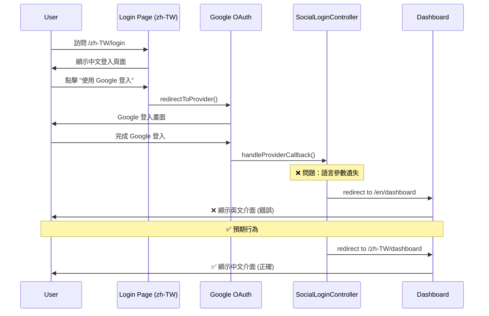

# Session: Google Login 語言介面保留問題

**Date**: 2026-01-14  
**Status**: 🔄 In Progress  
**Duration**: [預估] 2 小時  
**Issue**: #TBD  
**Contributors**: @kiddchan, Antigravity AI  
**Branch**: fix/google-login-locale-preservation  
**Tags**: #bug, #i18n, #oauth, #ux

**Categories**: Authentication, Internationalization (i18n), User Experience

---

## 📋 Overview

### Goal
修復 Google Sign-In 登入後語言介面不一致的問題：當使用者在中文介面 (`/zh-TW/login`) 使用 Google 登入後，應該導向中文介面的 Dashboard，而不是英文介面。

### Related Documents
- **Related Sessions**: 
  - `03-i18n-refactoring.md` - i18n 重構
  - `02-oauth-forgot-password-ux.md` - OAuth 相關功能

### Commits
- [開發過程中填寫]

---

## 🎯 Context

### Problem
**現象**：
- 使用者在 `https://holdyourbeers.com/zh-TW/login` 頁面點擊 Google Sign-In
- 登入成功後，畫面顯示為英文介面 (預設 `en`)
- 預期應該顯示中文介面 (`zh-TW`)

**根本原因分析**：
1. `SocialLoginController::handleProviderCallback()` 在處理 OAuth 回調時，語言參數 (`$locale`) 的取得邏輯有問題
2. 目前的實作在第 39 行：
   ```php
   $targetLocale = ($provider !== null) ? $locale : 'en';
   ```
   這個邏輯假設如果 `$provider` 不為 null，則 `$locale` 參數就是語言代碼
3. 但實際上，Google OAuth 回調時可能沒有正確傳遞語言參數

### User Story
> As a **使用者**,  
> I want to **在中文介面使用 Google 登入後，仍然看到中文介面**,  
> so that **我的使用體驗保持一致，不需要手動切換語言**。

### User Flow


### Current State

**現有實作**：
1. **路由定義** (`routes/web.php`):
   ```php
   // Localized routes
   Route::get('/auth/{provider}/redirect', [SocialLoginController::class, 'redirectToProvider'])
       ->name('localized.social.redirect');
   Route::get('/auth/{provider}/callback', [SocialLoginController::class, 'handleProviderCallback'])
       ->name('localized.social.callback');
   
   // Non-localized routes (fallback)
   Route::get('/auth/{provider}/redirect', [SocialLoginController::class, 'redirectToProvider'])
       ->name('social.redirect');
   Route::get('/auth/{provider}/callback', [SocialLoginController::class, 'handleProviderCallback'])
       ->name('social.callback');
   ```

2. **控制器方法** (`SocialLoginController.php`):
   - `redirectToProvider($locale = null, $provider = null)` - 第 19 行
   - `handleProviderCallback($locale = null, $provider = null)` - 第 34 行
   - 語言判斷邏輯：第 39 行

3. **Google Login Button** (`resources/views/components/google-login-button.blade.php`):
   ```php
   <a href="{{ route('social.redirect', ['provider' => 'google']) }}"
   ```
   ❌ **問題**：使用的是 `social.redirect` (非本地化路由)，而不是 `localized.social.redirect`

4. **Login Page** (`resources/views/auth/login.blade.php`):
   - 第 98 行有動態判斷邏輯：
   ```php
   $socialRoute = request()->route()->getName() === 'localized.login' 
       ? 'localized.social.redirect' 
       : 'social.redirect';
   ```

**Gap**: 
- Google Login Button 元件沒有正確使用本地化路由
- OAuth 回調時語言參數可能遺失
- 需要一個可靠的機制來保留使用者的語言偏好

---

## 💡 Planning

### Approach Analysis

#### Option A: 使用 Session 儲存語言偏好 [✅ CHOSEN]
在 OAuth 流程中使用 Session 來保留語言設定：

1. **Redirect 階段**：在 `redirectToProvider()` 中將語言儲存到 Session
2. **Callback 階段**：在 `handleProviderCallback()` 中從 Session 讀取語言
3. **Fallback**：如果 Session 中沒有語言設定，則使用 URL 參數或預設值

**實作步驟**：
```php
// redirectToProvider() 中
public function redirectToProvider($locale = null, $provider = null): RedirectResponse
{
    $actualProvider = $provider ?? $locale;
    $targetLocale = ($provider !== null) ? $locale : 'en';
    
    // 儲存語言到 Session
    Session::put('oauth_redirect_locale', $targetLocale);
    
    return Socialite::driver($actualProvider)
        ->stateless()
        ->redirect();
}

// handleProviderCallback() 中
public function handleProviderCallback($locale = null, $provider = null): RedirectResponse
{
    // 優先從 Session 讀取語言
    $targetLocale = Session::get('oauth_redirect_locale', 'en');
    
    // 清除 Session
    Session::forget('oauth_redirect_locale');
    
    // ... 其他邏輯 ...
    
    return redirect()->route('localized.dashboard', ['locale' => $targetLocale]);
}
```

**Pros**:
- ✅ 可靠：不依賴 URL 參數傳遞
- ✅ 簡單：只需修改控制器，不需要改動路由
- ✅ 向後相容：不影響現有的非本地化路由
- ✅ 測試容易：可以直接測試 Session 的讀寫

**Cons**:
- ⚠️ 依賴 Session：需要確保 Session 正常運作
- ⚠️ 狀態管理：需要記得清除 Session 避免污染

#### Option B: 使用 State 參數傳遞語言 [❌ REJECTED]
利用 OAuth 的 `state` 參數來傳遞語言設定：

```php
return Socialite::driver($actualProvider)
    ->with(['state' => base64_encode(json_encode(['locale' => $targetLocale]))])
    ->redirect();
```

**Pros**:
- ✅ 無狀態：不依賴 Server-side Session
- ✅ 安全：state 參數會被 OAuth provider 原樣返回

**Cons**:
- ❌ 複雜：需要處理 state 參數的編碼/解碼
- ❌ 安全性考量：state 參數主要用於 CSRF 防護，混用可能造成安全問題
- ❌ Laravel Socialite 限制：`stateless()` 模式下 state 參數行為可能不一致

#### Option C: 修改 Google Login Button 使用本地化路由 [⏳ COMPLEMENTARY]
修改 `google-login-button.blade.php` 元件，讓它根據當前路由動態選擇：

```php
@php
    $socialRoute = request()->route()->getName() === 'localized.login' 
        ? 'localized.social.redirect' 
        : 'social.redirect';
    $routeParams = $socialRoute === 'localized.social.redirect'
        ? ['locale' => app()->getLocale(), 'provider' => 'google']
        : ['provider' => 'google'];
@endphp

<a href="{{ route($socialRoute, $routeParams) }}"
```

**Pros**:
- ✅ 根本解決：從源頭確保使用正確的路由
- ✅ 一致性：與 login.blade.php 的邏輯一致

**Cons**:
- ⚠️ 不完整：無法解決 OAuth callback 時的語言遺失問題
- ⚠️ 需要配合 Option A 或 B

**Decision Rationale**: 
選擇 **Option A (Session) + Option C (修改元件)** 的組合方案：
1. Option A 提供可靠的語言保留機制
2. Option C 確保從源頭使用正確的路由
3. 兩者結合可以提供最佳的使用者體驗和程式碼可維護性

### Design Decisions

#### D1: 語言保留機制
- **Options**: Session, State Parameter, Cookie
- **Chosen**: Session
- **Reason**: 
  - Laravel 已經有完善的 Session 管理機制
  - 不會與 OAuth state 參數的安全功能衝突
  - 實作簡單且可靠
- **Trade-offs**: 需要確保 Session 在 OAuth 流程中正常運作

#### D2: Google Login Button 路由選擇
- **Options**: 固定使用 localized route, 固定使用 non-localized route, 動態判斷
- **Chosen**: 動態判斷
- **Reason**: 
  - 與現有 login.blade.php 的實作一致
  - 支援兩種路由模式，向後相容
- **Trade-offs**: 程式碼稍微複雜一點，但更靈活

---

## ✅ Implementation Checklist

### Phase 1: 修復 Google Login Button 元件 [⏳ Pending]
- [ ] 修改 `google-login-button.blade.php`，加入動態路由選擇邏輯
- [ ] 確保元件在本地化和非本地化路由下都能正常運作
- [ ] 測試元件在不同頁面的顯示

### Phase 2: 實作 Session 語言保留機制 [⏳ Pending]
- [ ] 修改 `SocialLoginController::redirectToProvider()`
  - [ ] 儲存語言到 Session (`oauth_redirect_locale`)
  - [ ] 加入 Log 記錄便於除錯
- [ ] 修改 `SocialLoginController::handleProviderCallback()`
  - [ ] 從 Session 讀取語言
  - [ ] 清除 Session 避免污染
  - [ ] 加入 Fallback 邏輯
  - [ ] 加入 Log 記錄

### Phase 3: 測試 [⏳ Pending]
- [ ] 手動測試：中文介面 Google 登入流程
  - [ ] 新使用者註冊
  - [ ] 現有使用者登入
- [ ] 手動測試：英文介面 Google 登入流程
- [ ] 手動測試：非本地化路由的 Google 登入
- [ ] 撰寫自動化測試 (Feature Test)
  - [ ] 測試 Session 的儲存和讀取
  - [ ] 測試語言參數的正確傳遞
  - [ ] 測試 Fallback 邏輯

### Phase 4: 文檔更新 [⏳ Pending]
- [ ] 更新 Session 文件
- [ ] 更新相關的 INDEX 文件
- [ ] 記錄 Lessons Learned

---

## 🚧 Blockers & Solutions

### Blocker 1: OAuth Stateless 模式下的 Session 行為 [⏸️ POTENTIAL]
- **Issue**: Laravel Socialite 的 `stateless()` 模式可能影響 Session 的讀寫
- **Impact**: 如果 Session 無法正常運作，語言保留機制會失效
- **Solution**: 
  - 先進行測試驗證 Session 在 OAuth 流程中的行為
  - 如果 Session 不可用，則改用 Option B (State Parameter)
- **Resolved**: [待測試]

---

## 📊 Outcome

### What Was Built
[交付成果清單 - 完成後填寫]

### Files Created/Modified
```
app/Http/Controllers/
├── SocialLoginController.php (modified)
resources/views/components/
├── google-login-button.blade.php (modified)
tests/Feature/Auth/
├── GoogleLoginLocaleTest.php (new)
```

### Metrics
- **Code Coverage**: TBD
- **Lines Added**: ~TBD
- **Lines Modified**: ~TBD
- **Test Files**: TBD

---

## 🎓 Lessons Learned

### 1. OAuth 流程中的狀態管理
**Learning**: OAuth 流程涉及多次重定向，需要特別注意狀態的保留

**Solution/Pattern**: 使用 Session 或 State Parameter 來保留必要的上下文資訊

**Future Application**: 
- 其他需要在 OAuth 流程中保留狀態的場景
- 考慮建立一個通用的 OAuth State Manager

---

## ✅ Completion

**Status**: 🔄 In Progress → ⏳ Pending
**Completed Date**: TBD
**Session Duration**: TBD

> ℹ️ **Next Steps**: 詳見 [Session Guide](../GUIDE.md)
> 1. 更新上方狀態與日期
> 2. 根據 Tags 更新 INDEX 檔案
> 3. 運行 `../../.agent/scripts/archive-session.sh`

---

## 🔮 Future Improvements

### Not Implemented (Intentional)
- ⏳ 使用 Cookie 來保留語言偏好（跨 Session）
  - 原因：目前 Session 已足夠，Cookie 會增加複雜度

### Potential Enhancements
- 📌 建立通用的 OAuth State Manager
- 📌 支援更多 OAuth Providers (Facebook, GitHub, etc.)
- 📌 在 User Profile 中儲存語言偏好

### Technical Debt
- 🔧 目前的路由設計有重複（localized 和 non-localized）
  - 未來可以考慮統一使用本地化路由

---

## 🔗 References

### Related Work
- [Laravel Socialite Documentation](https://laravel.com/docs/11.x/socialite)
- [OAuth 2.0 State Parameter](https://www.oauth.com/oauth2-servers/redirect-uris/state-parameter/)

### External Resources
- [Laravel Session Documentation](https://laravel.com/docs/11.x/session)

### Team Discussions
- [待補充]
