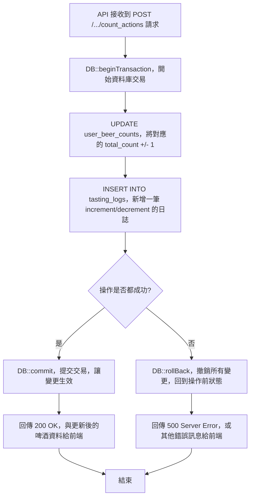

### 流程圖三：後端核心邏輯 - 計數動作 (Transaction)

這張圖專門描繪後端在收到「+1」或「-1」請求時，內部執行的、包含「資料庫交易」的關鍵邏輯，以確保資料一致性。

備註：Web 端（`TastingController@increment/decrement`）與 API 端共用相同一致性策略，皆使用 `DB::transaction(...)` 並在讀取 `user_beer_counts` 時以 `lockForUpdate()` 取得列級鎖，避免競態條件造成的計數異常或日誌遺失。

