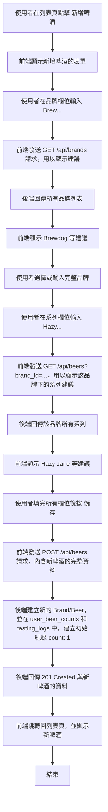

### 流程圖二：使用者新增一個全新的啤酒品項

這張圖描繪了使用者如何從頭開始，新增一個他從未記錄過的啤酒品牌和系列。

```mermaid
graph TD
    A[使用者在列表頁點擊 新增啤酒] --> B[前端顯示新增啤酒的表單]
    B --> C[使用者在品牌欄位輸入 Brew...]
    C --> D[前端發送 GET /api/brands 請求，用以顯示建議]
    D --> E[後端回傳所有品牌列表]
    E --> F[前端顯示 Brewdog 等建議]
    F --> G[使用者選擇或輸入完整品牌]
    G --> H[使用者在系列欄位輸入 Hazy...]
    H --> I[前端發送 GET /api/beers?brand_id=...，用以顯示該品牌下的系列建議]
    I --> J[後端回傳該品牌所有系列]
    J --> K[前端顯示 Hazy Jane 等建議]
    K --> L[使用者填完所有欄位後按 儲存]
    L --> M[前端發送 POST /api/beers 請求，內含新啤酒的完整資料]
    M --> N[後端建立新的 Brand/Beer，並在 user_beer_counts 和 tasting_logs 中，建立初始紀錄 count: 1]
    N --> O[後端回傳 201 Created 與新啤酒的資料]
    O --> P[前端跳轉回列表頁，並顯示新啤酒]
    P --> Q[結束]
```